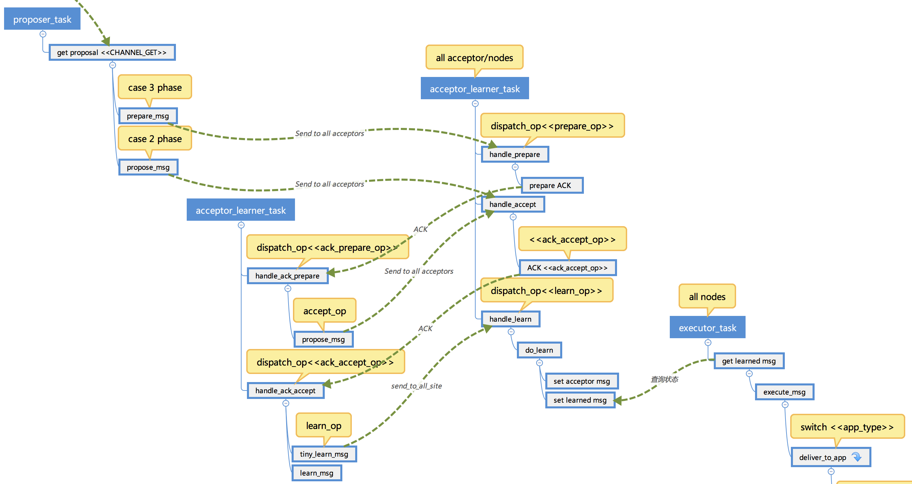
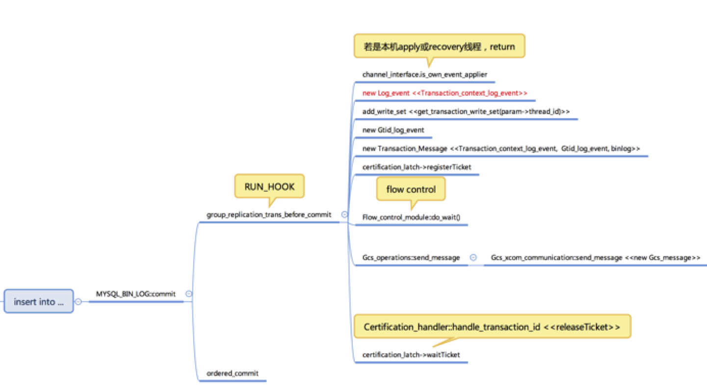
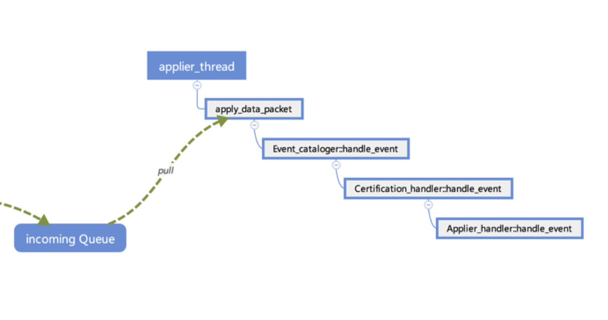

[

# 数据库内核月报 － 2018 / 01

](http://mysql.taobao.org/monthly/2018/01)

[›](http://mysql.taobao.org/monthly/2018/01/02/)

*   [当期文章](#)

## MySQL · 引擎特性 · Group Replication内核解析之二

## 背景

前文已经介绍了MySQL的Group Replication的实现机制和原理，本文就Group Replication的具体实现进行详细的阐述，以更深入的理解Group Replication的机制，在实践中更好的应用Group Replication，提升应用系统的可用性，优化其性能。

## 无缝连接的回调机制

Group Replication是通过MySQL的插件方式实现的，基本上不影响MySQL的原有事务处理过程，只是在流程中选择性的插入一些Group Replication的特殊处理方法，为了尽可能减少对原有代码的影响，采用了回调函数的机制来实现对Group Replication的支持。 其中最重要的两个回调函数集如下所示：

*   节点状态相关的回调函数集 Server\_state\_observer server\_state\_observer = { sizeof(Server\_state\_observer),
    
    group\_replication\_before\_handle\_connection, //client连接到服务器之前 group\_replication\_before\_recovery, //故障恢复之前 group\_replication\_after\_engine\_recovery, //引擎恢复之后 group\_replication\_after\_recovery, //故障恢复之后 group\_replication\_before\_server\_shutdown, //server关闭之前 group\_replication\_after\_server\_shutdown, //server关闭之后 };
    
*   事务处理相关的回调函数集 Trans\_observer trans\_observer = { sizeof(Trans\_observer), group\_replication\_trans\_before\_dml, //DML语句执行之前，条件检查 group\_replication\_trans\_before\_commit, //事务提交之前 ，节点间事务同步 group\_replication\_trans\_before\_rollback, //事务回滚之后 group\_replication\_trans\_after\_commit, //事务提交之后 group\_replication\_trans\_after\_rollback, //事务回滚之后 }; 其中最重要的回调函数是
    
*   group\_replication\_trans\_before\_dml：用于执行条件检查，判断是否符合Group Replication的限制条件。
*   group\_replication\_trans\_before\_commit：在binlog已经写入cache，准备提交之前通过XCOM组件进行事务的节点间同步。

## XCOM消息传递机制

XCOM是一个基于paxos协议的分布式同步组件，Group Replication通过它将一个节点上的事务(事务采用binlog来表示)，传递到整个分布式系统中的多数节点，保证所有节点最终都会收到此事务，并且不改变事务的执行顺序。 Server在事务提交之前，将事务的binlog打包，并添加此事务执行过程中产生的writeset及基于group replication的全局GTID。然后将其发送给本机的XCOM线程。 XCOM组件内部有一个任务Task线程，主线程通过Task调度队列来调度执行Task，每个Task任务可认为是一个协程，重要的Task有；

*   tcp\_server 监听xcom端口，当有新连接时为其创建acceptor\_learner\_task任务
    
*   tcp\_reaper\_task 关闭长时间未使用的连接
    
*   acceptor\_learner\_task 此任务是XCOM的核心任务，实现基于paxos协议的消息流转过程，并最终决定accept还是deny此消息。
*   proposer\_task 从server的消息请求队列中读取一条消息，封装为paxos的proposal消息，发送给其它节点，尝试此消息被paxos系统accept。每个节点可以有多个proposer\_task，XCOM并不保证多个proposer\_task以server发出同步消息的顺序来发送proposal消息。当一个消息被accepted后，通过learn消息通知到每个节点，成为learned消息。
*   executor\_task 监听learned消息，若此消息尚未被应用，则通知server应用此消息。
*   detector\_task 周期性的检测与其它节点间的连接可用性。若有连接不可用，通知server。
*   alive\_task 产生心跳消息。 消息被acceptor的过程，如下图所示：

1) 源节点的proposal\_task从server的消息队列中提取一个消息，若是3phase，封装为prepare消息，开始acceptor的阶段一，将prepare消息发送给的所有acceptor节点；若是2phase，则封装为proposal消息，将proposal消息发送给所有acceptor节点，此时会跳到阶段二；

2) acceptor节点的acceptor\_learner\_task收到prepare消息后，判断是否可以阶段一的accept，然后返回ACK；

3) 源节点的acceptor\_learner\_task收到ACK后，更新收到ACK的节点位图，若已经收到多数acceptor的ACK后，进入阶段二，向所有acceptor节点发送proposal消息；

4) acceptor节点的acceptor\_learner\_task收到proposal消息后，判断是否可以阶段二的accept，然后返回ACK；

5) 源节点的acceptor\_learner\_task收到ACK后，更新收到ACK的节点位图，若已经收到多数acceptor的ACK后，说明此消息已经被paxos系统accept，然后将此消息通知所有节点，向所有节点发出learn消息；

6) 所有节点的acceptor\_learner\_task收到learn消息后，将此消息加入到当前节点的learned消息中。

7) 每个节点的executor\_task检测本节点是否有新的learned消息，若有则将其通知server层，进行后续处理。

## 节点间事务的同步

在Group Replication中，若用户在一个节点执行一条SQL，如一条Insert语句，在提交之前已经生成此语句的binlog，并将其写入cache，此时需要通过XCOM来进行节点的事务同步，将此事务同步到多数节点，并判断此事务与其它节点的事务之间是否存在冲突，若存在冲突此事务是否需要回滚等。 下图是一个简单的SQL语句导致的消息传递过程。

当节点收到Notification消息后，将其加入incomingQ队列中，然后applier thread读取incomingQ队列中的消息，依次执行event事件的处理过程。对于一个insert语句来说，它的event事件由以下几部分组成：

*   Transaction\_context\_log\_event
*   Gtid\_log\_event
*   Query\_log\_event

每个event会依次进入event handler pipeline执行相应的处理，如下图所示：

## 总结

MySQL Group Replication在提交事务之前通过XCOM来进行节点间事务的同步，保证事务提交前，多数节点上已经保存此事务相关的binlog event，从而保证节点间事务的一致性。 为降低MySQL与XCOM代码的耦合性，采用消息通知、回调函数等机制有效的对不同模块进行隔离，了解这些机制有助于我们更好的理解Group Replication的原理和代码。

[阿里云RDS-数据库内核组](http://mysql.taobao.org/)  
[欢迎在github上star AliSQL](https://github.com/alibaba/AliSQL)  
阅读： -  
  
本作品采用[知识共享署名-非商业性使用-相同方式共享 3.0 未本地化版本许可协议](http://creativecommons.org/licenses/by-nc-sa/3.0/)进行许可。

---------------------------------------------------

原网址: [访问](http://mysql.taobao.org/monthly/2018/01/01/)

创建于: 2020-09-14 16:56:30

目录: default

标签: `mysql.taobao.org`

