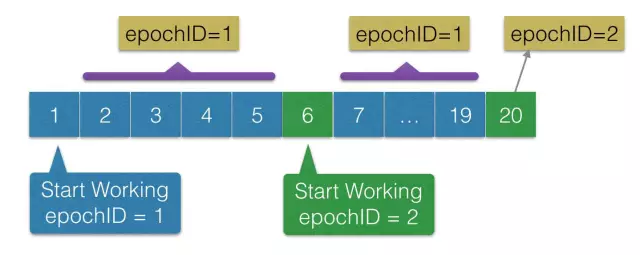

# 架构师需要了解的Paxos原理、历程及实战

## 架构师需要了解的Paxos原理、历程及实战

原创 李凯 [高可用架构](javascript:) _2016-01-18_

_编者按：_高可用架构分享及传播在架构领域具有典型意义的文章_，本文由李凯分享。转载请注明来自高可用架构公众号「ArchNotes」。_

  

> 李凯，目前在美团云计算部担任高级技术专家，带领存储团队。2007 年加入百度从事分布式平台 Pyramid 项目研发；2010 年在 OceanBase 立项初期，加入阿里，花名郁白，5 年中主要时间都在开发和维护 OceanBase 的 UpdateServer 模块。  

  

“这里提一个名词：‘最大 Commit 原则’，这个阳振坤博士给我讲授 Paxos 时提出的名词，我觉得它是 Paxos 协议的最重要隐含规则之一，一条超时未形成多数派应答的提案，我们即不能认为它已形成决议，也不能认为它未形成决议，跟‘薛定谔的猫’差不多，这条日志是‘又死又活’的，只有当你观察它（执行 Paxos 协议）的时候，你才能得到确定的结果。” —— 李凯

  

## 数据库高可用性难题

## 数据库的数据一致和持续可用对电子商务和互联网金融的意义不言而喻，而这些业务在使用数据库时，无论 MySQL 还是 Oracle，都会面临一个艰难的取舍，就是如何处理主备库之间的数据同步。对于传统的主备模式或者一主多备模式，我们都需要考虑的问题，就是与备机保持强同步还是异步复制。  

  

对于强同步模式，要求主机必须把 Redolog 同步到备机之后，才能应答客户端，一旦主备之间出现网络抖动，或者备机宕机，则主机无法继续提供服务，这种模式实现了数据的强一致，但是牺牲了服务的可用性，且由于跨机房同步延迟过大使得跨机房的主备模式也变得不实用。  
  
而对于异步复制模式，主机写本地成功后，就可以立即应答客户端，无需等待备机应答，这样一旦主机宕机无法启动，少量不同步的日志将丢失，这种模式实现了服务持续可用，但是牺牲了数据一致性。这两种方式对应的就是 Oracle 的 Max Protection 和 Max Performance 模式，而 Oracle 另一个最常用的 Max Availability 模式，则是一个折中，在备机无应答时退化为 Max Performance 模式，我认为本质上还是异步复制。  
  
主备模式还有一个无法绕过的问题，就是选主，最简单山寨的办法，搞一个单点，定时 Select 一下主机和各个备机，貌似 MHA 就是这个原理，具体实现细节我就不太清楚了。一个改进的方案是使用类似 ZooKeeper 的多点服务替代单点，各个数据库机器上使用一个 Agent 与单点保持 Lease，主机 Lease 过期后，立即置为只读。改进的方案基本可以保证不会出现双主，而缺点是 ZooKeeper 的可维护性问题，以及多级 Lease 的恢复时长问题（这个本次就不展开讲了，感兴趣的同学请参考这篇文章 Http://oceanbase.org.cn/

  

## Paxos 协议简单回顾

主备方式处理数据库高可用问题有上述诸多缺陷，要改进这种数据同步方式，我们先来梳理下数据库高可用的几个基本需求：  

  

1.  数据不丢失
    
2.  服务持续可用
    
3.  自动的主备切换
    

  

使用Paxos协议的日志同步可以实现这三个需求，而 Paxos 协议需要依赖一个基本假设，主备之间有多数派机器（N / 2 + 1）存活并且他们之间的网络通信正常，如果不满足这个条件，则无法启动服务，数据也无法写入和读取。  
  
我们先来简单回顾一下 Paxos 协议的内容，首先，**Paxos 协议是一个解决分布式系统中，多个节点之间就某个值（提案）达成一致（决议）的通信协议**。它能够处理在少数派离线的情况下，剩余的多数派节点仍然能够达成一致。然后，再来看一下协议内容，它是一个两阶段的通信协议，推导过程我就不写了（中文资料请参考这篇 Http://t.cn/R40lGrp ），直接看最终协议内容：

  

**1、第一阶段 Prepare**

**P1a：Proposer 发送 Prepare**  

Proposer 生成全局唯一且递增的提案 ID（Proposalid，以高位时间戳 + 低位机器 IP 可以保证唯一性和递增性），向 Paxos 集群的所有机器发送 PrepareRequest，这里无需携带提案内容，只携带 Proposalid 即可。

  

**P1b：Acceptor 应答 Prepare**  
Acceptor 收到 PrepareRequest 后，做出“两个承诺，一个应答”。

  

两个承诺：

*   第一，不再应答 Proposalid 小于等于（注意：这里是 <= ）当前请求的 PrepareRequest；
    
*   第二，不再应答 Proposalid 小于（注意：这里是 < ）当前请求的 AcceptRequest
    

  

一个应答：

*   返回自己已经 Accept 过的提案中 ProposalID 最大的那个提案的内容，如果没有则返回空值;
    

  

注意：这“两个承诺”中，蕴含两个要点：

  

1.  就是应答当前请求前，也要按照“两个承诺”检查是否会违背之前处理 PrepareRequest 时做出的承诺；
    
2.  应答前要在本地持久化当前 Propsalid。
    

  

**2、第二阶段 Accept**

**P2a：Proposer 发送 Accept**  
“提案生成规则”：Proposer 收集到多数派应答的 PrepareResponse 后，从中选择proposalid最大的提案内容，作为要发起 Accept 的提案，如果这个提案为空值，则可以自己随意决定提案内容。然后携带上当前 Proposalid，向 Paxos 集群的所有机器发送 AccpetRequest。

  
**P2b：Acceptor 应答 Accept**

Accpetor 收到 AccpetRequest 后，检查不违背自己之前作出的“两个承诺”情况下，持久化当前 Proposalid 和提案内容。最后 Proposer 收集到多数派应答的 AcceptResponse 后，形成决议。

  

这里的“两个承诺”很重要，后面也会提及，请大家细细品味。

  

## Basic Paxos 同步日志的理论模型

上面是 Lamport 提出的算法理论，那么 Paxos 协议如何具体应用在 Redolog 同步上呢，我们先来看最简单的理论模型，就是在 N 个 Server的机群上，持久化数据库或者文件系统的操作日志，并且为每条日志分配连续递增的 LogID，允许多个客户端并发的向机群内的任意机器发送日志同步请求。在这个场景下，不同 Logid 标识的日志都是一个个相互独立的 Paxos Instance，每条日志独立执行完整的 Paxos 两阶段协议。  

  
因此在执行 Paxos 之前，需要先确定当前日志的 Logid，理论上对每条日志都可以从 1 开始尝试，直到成功持久化当前日志，但是为了降低失败概率，可以先向集群内的 Acceptor 查询他们 PrepareResponse 过的最大 Logid，从多数派的应答结果中选择最大的 Logi-d，加 1 后，作为本条日志的 Logid。然后以当前 Logid 标识 Paxos Instance，开始执行Paxos两阶段协议。可能出现的情况是，并发情况下，当前 Logid 被其他日志使用，那么在 P2a 阶段确定的提案内容可能就不是自己本次要同步的日志内容，这种情况下，就要重新决定logid，然后重新开始执行 Paxos 协议。  
  
考虑几种异常情况，Proposer 在 P1b 或 P2b 阶段没有收到多数派应答，可能是受到了其他 Logid 相同而 Proposalid 更大的 Proposer 干扰，或者是网络、机器等问题，这种情况下则要使用相同的 Logid，和新生成的 Proposalid 来重新执行 Paxos 协议。恢复时，按照 Logid 递增的顺序，针对每条日志执行完整 Paxos 协议成功后，形成决议的日志才可以进行回放。那么问题来了：比如 A/B/C 三个 Server，一条日志在 A/B 上持久化成功，已经形成多数派，然后B宕机；另一种情况，A/B/C 三个 Server，一条日志只在A 上持久化成功，超时未形成多数派，然后B宕机。上述两种情况，最终的状态都是 A 上有这条日志，C 上没有，那么应该怎么处理呢？  
  
这里提一个名词：“**最大 Commit 原则**”，这个阳振坤博士给我讲授 Paxos 时提出的名词，我觉得它是 Paxos 协议的最重要隐含规则之一，**一条超时未形成多数派应答的提案，我们即不能认为它已形成决议，也不能认为它未形成决议**，跟“薛定谔的猫”差不多，这条日志是“又死又活”的，只有当你观察它（执行 Paxos 协议）的时候，你才能得到确定的结果。因此对于上面的问题，答案就是无论如何都对这条日志重新执行 Paxos。这也是为什么在恢复的时候，我们要对每条日志都执行 Paxos 的原因。

  

## Multi Paxos 的实际应用

## 上述 Basic-Paxos 只是理论模型，在实际工程场景下，比如数据库同步 Redolog，还是需要集群内有一个 leader，作为数据库主机，和多个备机联合组成一个 Paoxs 集群，对 Redolog 进行持久化。此外持久化和回放时每条日志都执行完整 Paxos 协议（3 次网络交互，2 次本地持久化），代价过大，需要优化处理。因此使用 Multi-Paxos 协议，要实现如下几个重要功能：  

  

1.  自动选主
    
2.  简化同步逻辑
    
3.  简化回放逻辑
    

  

我在刚刚学习 Paxos 的时候，曾经认为选主就是跑一轮 Paxos 来形成“谁是 leader”的决议，其实并没有这么简单，因为 Paxos 协议的基本保证就是一旦形成决议，就不能更改，那么再次选新主就没办法处理了。因此对“选主”，需要变通一下思路，还是执行 Paxos 协议，但是我们并不关心决议内容，而是关心“谁成功得到了多数派的 AcceptResponse”，这个 Server 就是选主产生的 Leader。而多轮选主，就是针对同一个 Paxos Instance 反复执行，最后赢得多数派 Accept 的 Server 就是“当选 Leader”。

  

不幸的是执行 Paxos 胜出的“当选 Leader”还不能算是真正的 Leader，只能算是“**当选 Leader**”，就像美国总统一样，“当选总统”是赢得选举的总统，但是任期还未开始他还不是真正的总统。在 Multi-Paxos 中因为可能存在多个 Server 先后赢得了选主，因此新的“当选leader”还要立即写出一条日志，以确认自己的 Leader 身份。这里就顺势引出日志同步逻辑的简化，我们将 Leader 选主看作 Paxos 的 Prepare 阶段，这个 Prepare 操作在逻辑上一次性的将后续所有即将产生的日志都执行 Prepare，因此在 Leader任期内的日志同步，都使用同一个 Proposalid，只执行 Accept 阶段即可。那么问题来了，各个备机在执行 Accept 的时候，需要注意什么？

  

答案是上面提到过的“两个承诺”，因为我们已经把选主的那轮 Paxos 看做 Prepare 操作了，所以对于后续要 Accept 的日志，要遵守“两个承诺”。所以，对于先后胜出选主的多个“当选 Leader”，他们同步日志时携带的 Proposalid 的大小是不同的，只有最大的 Pro-posalid 能够同步日志成功，成为正式的 Leader。  
  
再进一步简化，选主 Leader 后，“当选 Leader”既然必先写一条日志来确认自己的 Leader身份，而协议允许多个“当选 Leader”产生，那么选主过程的本质其实就是为了拿到各个备机的“两个承诺”而已，选主过程本身产生的决议内容并没有实际意义，所以可以进一步简化为只执行 Prepare 阶段，而无需执行 Accept。  
  
再进一步优化，与 Raft 协议不同，Multi-Paxos 并不要求新任 Leader 本地拥有全部日志，因此新任 Leader 本地可能与其他 Server 相差了一些日志，它需要知道自己要补全哪些日志，因此它要向多数派查询各个机器上的 MaxLogD，以确定补全日志的结束 LogID。这个操作成为 GetMaxLogID，我们可以将这个操作与选主的 Prepare 操作搭车一起发出。这个优化并非 Multi-Paxos 的一部分，只是一个工程上比较有效的实现。  
  
回放逻辑的简化就比较好理解了，Leader 对每条形成多数派的日志，异步的写出一条“确认日志”即可，回放时如果一条日志拥有对应的“确认日志”，则不需要重新执行 Paoxs，直接回放即可。对于没有“确认日志”的，则需要重新执行 Paxos。工程上为了避免“确认日志”与对应的 Redolog 距离过大而带来回放的复杂度，往往使用滑动窗口机制来控制他们的距离。同时“确认日志”也用来提示备机可以回放收到的日志了。与 Raft 协议不同，由于 Multi-Paxos 允许日志不连续的确认（**请思考：不连续确认的优势是什么？**），以及允许任何成员都可以当选 Leader，因此新任 leader 需要补全自己本地缺失的日志，以及对未“确认”的日志重新执行 Paxos。我把这个过程叫做日志的“重确认”，本质上就是按照“最大commit原则”，使用当前最新的 Proposalid，逐条的对这些日志重新执行 Paxos，成功后再补上对应的“确认日志”。

  
相对于 Raft 连续确认的特性，使用 Multi-Paxos 同步日志，由于多条日志间允许乱序确认，理论上会出现一种被称我们团队同学戏称为“幽灵复现”的诡异现象，如下图所示（图片引用自我的博客）

  
  
第一轮中A被选为 Leader，写下了 1-10 号日志，其中 1-5 号日志形成了多数派，并且已给客户端应答，而对于 6-10 号日志，客户端超时未能得到应答。

  
第二轮，A 宕机，B 被选为 Leader，由于 B 和 C 的最大的 LogID 都是 5，因此 B 不会去重确认 6 - 10 号日志，而是从 6 开始写新的日志，此时如果客户端来查询的话，是查询不到上一轮 6 - 10 号 日志内容的，此后第二轮又写入了 6 - 20 号日志，但是只有 6 号和 20 号日志在多数派。

  
第三轮，A 又被选为 Leader，从多数派中可以得到最大 LogID 为 20，因此要将 7 - 20 号日志执行重确认，其中就包括了 A 上的 7-10 号日志，之后客户端再来查询的话，会发现上次查询不到的 7 - 10 号日志又像幽灵一样重新出现了。  
  
处理“幽灵复现”问题，需要依赖新任 Leader 在完成日志重确认，开始写入新的 Redolog 之前，写出一条被称为 StartWorking 的日志，这条日志的内容中记录了当前 Leader 的 EpochID（ 可以使用 Proposalid 的值），并且 Leader 每写一条日志都在日志内容中携带现任 Leader 的 EpochID。回放时，经过了一条 StartWorking 日志之后，再遇到 EpochID 比它小的日志，就直接忽略掉，比如按照上面例子画出的这张图，7 - 19 号日志要在回放时被忽略掉。

  

  

  

## **依赖时钟误差的变种 Paxos 选主协议简单分析**  

阿里的阳振坤老师根据 Paxos 协议设计了一个简化版本的选主协议，相对 MultiPaxos 和 Raft 协议的优势在于，它不需要持久化任何数据，引入选主窗口的概念，使得大部分场景下集群内的所有机器能够几乎同时发起选主请求，便于投票时比对预定的优先级。下面的图引用自 OB 团队在公开场合分享 PPT 中的图片。  

  
如图所示，选主协议规定选主窗口开启是当前时间对一个T取余为0的时间，即只能在第 0，T，2T，3T...N\*T 的时间点上开启选主窗口，协议将一次选主划分为三个阶段

  

1.  T1 预投票开始即由各个选举组成员向集群里的其他机器发送拉票请求；
    
2.  一段时间后进入 T2 预投票开始，选举组各个成员根据接受到的拉票请，从中选出优先级最高的，给它投票应答；
    
3.  一段时间后进入 T3 计票阶段，收到多数派投票的成员成为 leader，并向投票组其他成员发送自己上任的消息。
    
      
    

假设时钟误差最大为 Tdiff，网络网路传输单程最长耗时为 Tst

  

1.  收到预投票消息的时间区间 \[T1 - Tdiff × 2，T1 + Tdiff × 2 + Tst = T2\]
    
2.  收到投票消息的时间区间 \[T2 - Tdiff×2，T2 + Tdiff × 2 + Tst = T3\]
    
3.  收到广播消息的时间区间 \[T3 - Tdiff×2，T3 + Tdiff × 2 + Tst = T4\]
    
4.  选主耗时 Telect = T4-T1 = Tdiff × 6 + Tst × 3
    

  

因此最差情况下，选主开始后，经过 Tdiff × 6 + Tst × 3 的 d 时间，就可以选出 Leader 各个成员投出选票后，就从自己的 T1 时刻开始计时，认为 leader 持续 lease 时间内有效，在 Lease 有效期内，Leader 每隔 Telect 的时间就向其他成员发出续约请求，将 Lease 时间顺延一个 Telect，如果 Lease 过期后 Leader 没有续约，则各个成员等待下一个选主窗口到来后发起选主。因此最差情况下的无主时间是：Lease 时间 + Telect + 选主窗口间隔时间 T。  
  
这个选主算法相对 Paxos 和 Raft 更加简单，但是对时钟误差有比较强的依赖，时钟误差过大的情况下，会造成投票分裂无法选出主，甚至可能出现双主（不过话说任何保持 Leader 身份的 Lease 机制都得依赖时钟…），因此可能仅仅适合 BAT 这种配备了原子钟和 GPS 校准时钟，能够控制时钟误差在 100ms 以内的土豪机房。2015 年闰秒时，这个选主算法已经上线至支付宝，当时测试了几个月吧，1 秒的跳变已经太大，当时测试了几个月，修改 ntp 配置缓慢校准，最后平稳渡过。

  

## Q & A

**1、ZooKeeper 所使用的 zad 协议与 Paxos 协议有什么区别？**

1.  Zab 用的是Epoch 和 Count 的组合来唯一表示一个值, 而Raft 用的是 Term和 Index.
    
2.  Zab 的 Follower 在投票给一个 Leader 之前必须和 Leader 的日志达成一致,而 Raft的 Follower 则简单地说是谁的 Term 高就投票给谁。
    
3.  Raft 协 议的心跳是从 Leader 到 Follower, 而 zab 协议则相反。
    
4.  Raft 协议数据只有单向地从 Leader 到 Follower (成为 Leader 的条件之一就是拥有最新的 Log), 而 Zab 协议在 Discovery 阶段, 一个 Prospective Leader 需要将自己的Log 更新为 Quorum 里面最新的 Log,然后才好在 Synchronization 阶段将 Quorum 里的其他机器的 Log 都同步到一致。
    

  

**2、Paxos 能完成在全球同步的业务吗？理论上支持多少机器同步?**  
Paxos 成员组横跨全球的案例我还没有见过 Paper，我个人认为它并不适合全球不同，原因是延迟太大，但是 Google 的 Spanner 和 Amazon 的 Aurora 都实现了横跨北美多 IDC 的同步；理论上多少都行，你能接受延迟就可以。

  

**3、问个问题，能否简单说说 Raft 算法和 Paxos 算法的异同？应用场的异同？**

Raft 可以认为是一种简化的 Multi-Paxos 实现，他的最大简化之处在于备机接受 Leader 日志的前提是收到 LogID 连续的日志，在这个假设前提下，没有我文中提到的“幽灵复现”和“重确认”问题。简化带来的代价是对网络抖动的容忍度稍低一些，考虑这样的场景 ABC 三台机器，C 临时下线一会错过一些日志，然后 C上 线了，但是在 C 补全日志之前，AB 如果再宕机一台的话，服务就停了。

  

**4、Paxos 实现是独立的库或服务还是和具体的业务逻辑绑定，上线前如何验证 Paxos 算法实现的正确性？**

OB 实现的 Paxos 是和事务 Redolog 库比较紧耦合的，没有独立的库；测试方案一个是 Monkey tests，随机模拟各种异常环境，包括断网、网络延迟、机器宕机、包重复到达等情况保持压力和异常；另外一个是做了一个简易的虚拟机，来解释测试 Case，通过人工构造多种极端的场景，来是系统立即进入一个“梦境”。

  

**5、Logid 和 proposalid都应该是不能重复的，这个是如何保证的？原子钟的精确性仅仅是为了选主吗？**

首先，Leader 任期内，Logid 只由 Leader 产生，没有重复性的问题；

第二，Leader 产生后，会执行 GetMaxLogID，从集群多数派拿到最大的 Logid，加以后作为本届任期内的 Logid 起点，这也可以保证有效日志 logid 不重复。Proposalid，高位使用 64 位时间戳，低位使用 IP 地址，可以保证唯一性和递增性。

  

**6、在用 Paxos 协议做 Master 和 Slave 一致性保证时，Paxos 日志回放应该怎样去做？**

Master 形成多数派确认后，异步的写出“确认日志”，Slave 回放到确认日志之后，才能去回放收到的正常日志。因此一般情况下，备机总是要落后主机一点点的。

  

_本文策划侠天、刘芸，编辑 Jsy，审校 Tim Yang，转载请注明来自高可用架构 「ArchNotes」微信公众号及包含以下二维码。_

_  
_

---------------------------------------------------

原网址: [访问](https://mp.weixin.qq.com/s?__biz=MzAwMDU1MTE1OQ==&mid=403582309&idx=1&sn=80c006f4e84a8af35dc8e9654f018ace&3rd=MzA3MDU4NTYzMw==&scene=6#rd)

创建于: 2020-09-09 15:13:34

目录: default

标签: `mp.weixin.qq.com`

