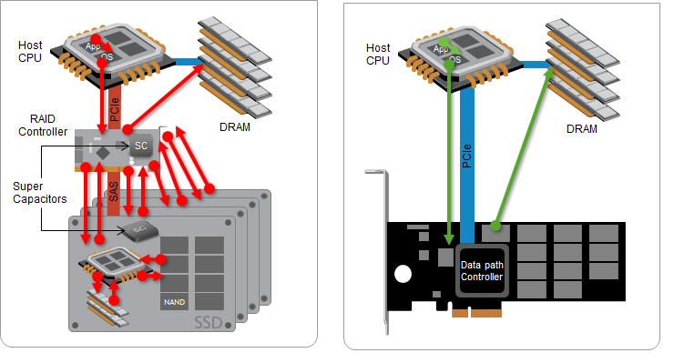
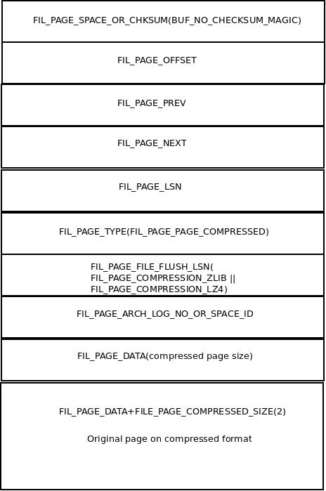
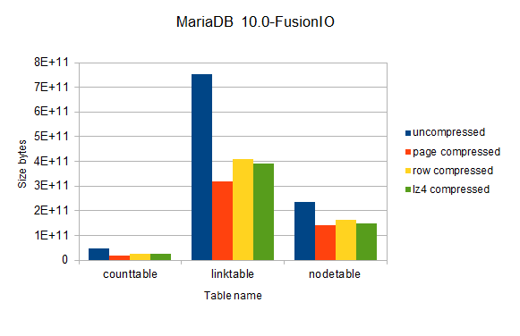
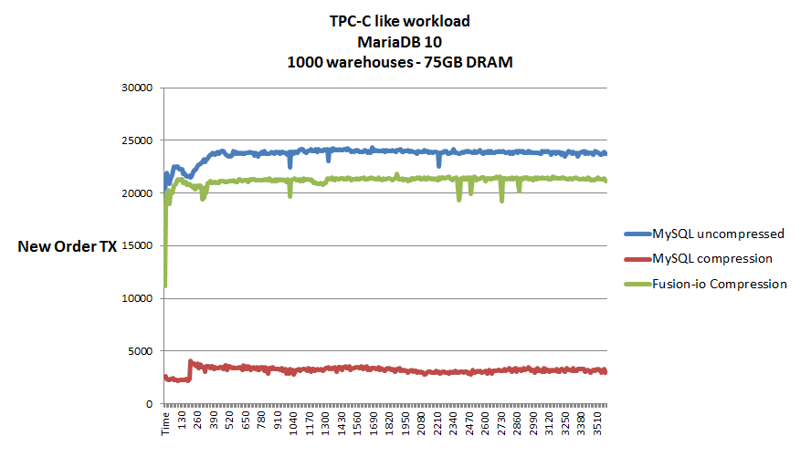

[

# 数据库内核月报 － 2014 / 08

](http://mysql.taobao.org/monthly/2014/08)

[‹](http://mysql.taobao.org/monthly/2014/08/06/)

[›](http://mysql.taobao.org/monthly/2014/08/08/)

*   [当期文章](#)

## MariaDB · 分支特性 · FusionIO特性支持

**背景**

随着存储设备越来越快，InnoDB许多原有的设计不再适合新的高速硬件，因此MariaDB 10.1 Alpha版本针对FusionIO PCI-E SSD做出了专门的优化，充分利用了Fio的硬件特性。 MDEV-6246这个需求改造了MariaDB，以利用fio的Atomic writes和文件系统压缩特性。

```css
revno: 3988 [merge]
committer: Jan Lindström &lt;jplindst@mariadb.org&gt;
branch nick: 10.1
timestamp: Thu 2014-05-22 14:24:00 +0300
message:
MDEV-6246: Merge 10.0.10-FusionIO to 10.1.
```

为何Fio会更快呢，因为传统的存储设备读取，是左图的方式，要经过RAID控制器，来回的路径就长了。而Fio才有右图的方式，设备通过PCI槽直接与CPU交互，大大缩短了路径。



**Atomic writes**

InnoDB一直存在一个叫做Double Write Buffer的东西，目的就是为了防止页面写到一半系统崩溃，导致页面损坏，因为InnoDB的Page是16K，而一般的机械硬盘扇区是512字节，SSD大都是4K的块大小，都不能保证16K的写入是完整的。 而Fio的NVMFS文件系统则提供了原子写的保证，只要对文件句柄增加DFS\_IOCTL\_ATOMIC\_WRITE\_SET的ioctl标记位，就可以启用这个文件的原子写支持。

```plain
ioctl(file, DFS_IOCTL_ATOMIC_WRITE_SET, &amp;atomic_option)
```

MariaDB新增了一个参数来启用这个特性，一旦开启，所有文件会用DFS\_IOCTL\_ATOMIC\_WRITE\_SET标记打开。

```plain
innodb_use_atomic_writes = 1
```

这样一来Double Write Buffer就没有存在的价值了，因为不会出现部分写，每个write下去都可以保证所写内容全部完成，这可以相当程度上提升InnoDB的性能。

**Page compression**

InnoDB标准的页面大小是16K，InnoDB也提供1K、2K、4K、8K的压缩页面大小，通过KEY\_BLOCK\_SIZE来设置压缩大小，使用zlib标准库来进行压缩。 但是Page是频繁被更新的，如果每次修改都重新压缩页面，代价很高，InnoDB就采用了modification log来暂存部分修改信息，而避免了频繁解压缩，待modification log存满时，再重新对整个Page做一次重构压缩。 但是Compressed Page载入InnoDB Buffer Pool时，InnoDB只能处理未压缩的页面，因此还要在内存中存一份解压页面，回写到磁盘时再次压缩。

总而言之，InnoDB的Compressed Page有这些缺点：

```perl
内存开销
空间: 压缩和解压缩页面都要存在InnoDB Buffer Pool
访问: 修改需要同时写入到压缩页面和未压缩页面
CPU开销
软件压缩库zlib (从磁盘读取时需要解压缩放入内存, 页面分裂时需要重新压缩)
Split &amp; Recompress &amp; Rebalance when mlog overflows
空间收益
固定的页面压缩大小 – 给压缩的效果设置了一个固定的边界
Modification log和Page预留空间弱化了压缩带来的空间缩减
糟糕的实现
代码过于复杂而导致压缩和未压缩的表性能差距非常明显
```

MariaDB与FusionIO合作利用NVMFS文件系统的特性，修改InnoDB的Page结构来支持文件系统级的压缩。 Page compression要求InnoDB做了如下配置：

```plain
innodb_file_per_table = 1
innodb_file_format = Barracuda.
```

它的实现方法是，只在Page即将写入到文件系统时，才进行压缩，因此最终只有压缩后的容量被写入到磁盘，如果压缩失败，那么就把没有压缩的容量写入磁盘。另外还会对Page内的512字节的倍数的未使用空间清理掉，不占用实际存储：

```plain
fallocate(file, FALLOC_FL_PUNCH_HOLE | FALLOC_FL_KEEP_SIZE, off, trim_len);
```

当页面被读取时，会在放入Buffer Pool之前进行解压缩，将原始页面载入内存。因此需要在文件头中加入一个新的Page type：FIL\_PAGE\_PAGE\_COMPRESSED 

综合起来可以这样定义一张表：

```sql
CREATE TABLE t3 (a int KEY, b int)  DATA DIRECTORY=’/dev/fioa’ PAGE_COMPRESSED=1 PAGE_COMPRESSION_LEVEL=4 ATOMIC_WRITES=’ON’;
```

意思是将t3表存到/dev/fioa盘，开启Page compression，采用4级压缩，开启原子写。

经过测试，可以看出，LZ4的压缩比例最好，而且，对性能影响非常小。





[阿里云RDS-数据库内核组](http://mysql.taobao.org/)  
[欢迎在github上star AliSQL](https://github.com/alibaba/AliSQL)  
阅读： -  
[](http://creativecommons.org/licenses/by-nc-sa/3.0/)  
本作品采用[知识共享署名-非商业性使用-相同方式共享 3.0 未本地化版本许可协议](http://creativecommons.org/licenses/by-nc-sa/3.0/)进行许可。

---------------------------------------------------


原网址: [访问](http://mysql.taobao.org/monthly/2014/08/07/)

创建于: 2020-09-04 18:26:04

目录: default

标签: `mysql.taobao.org`

