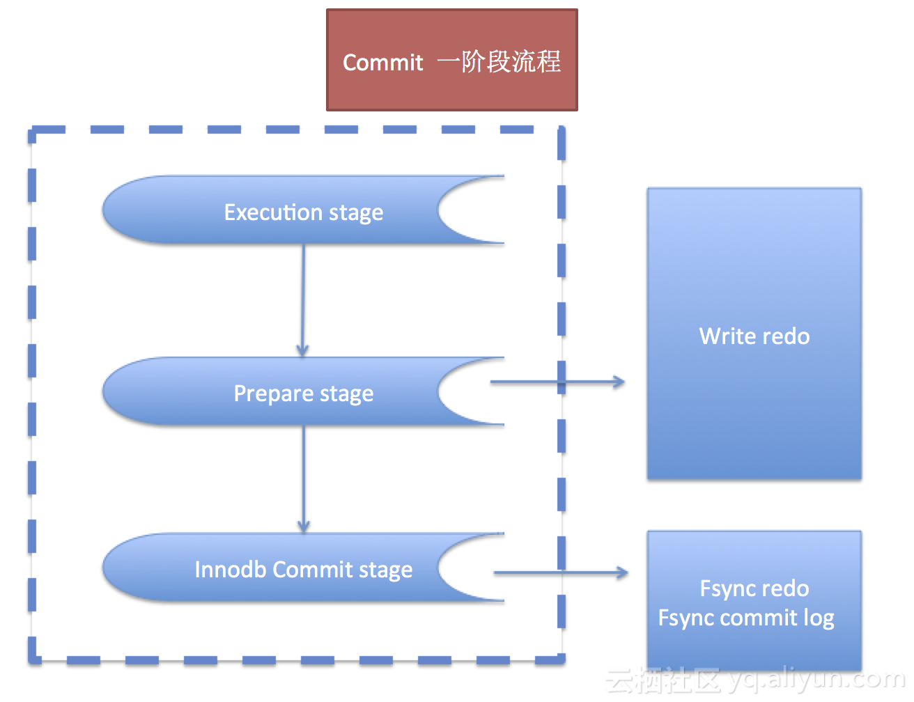
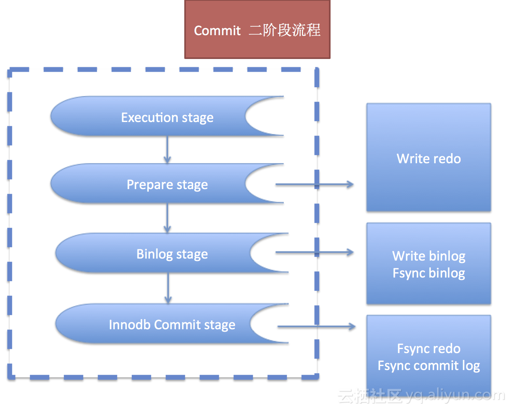
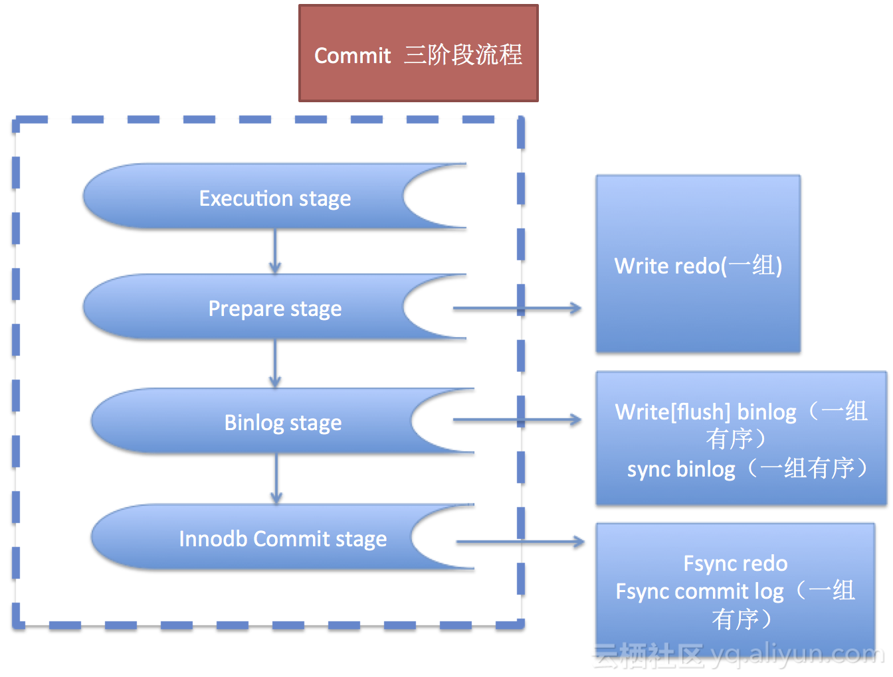
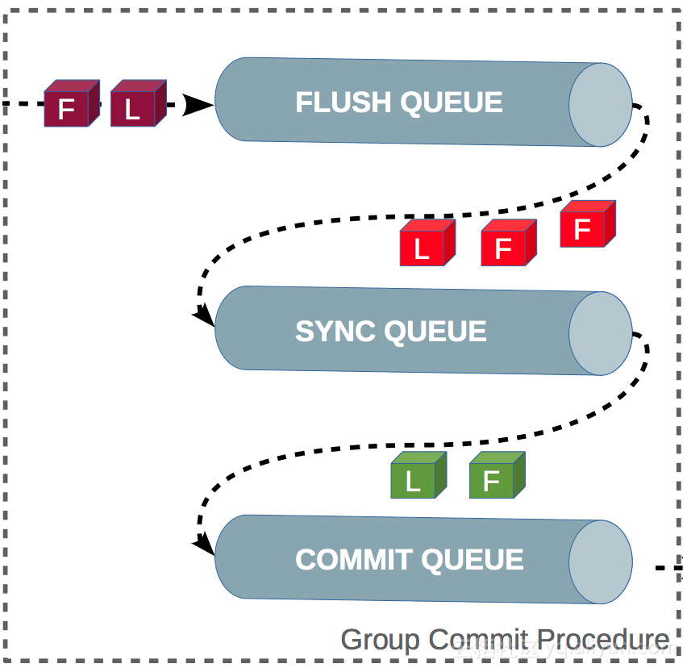
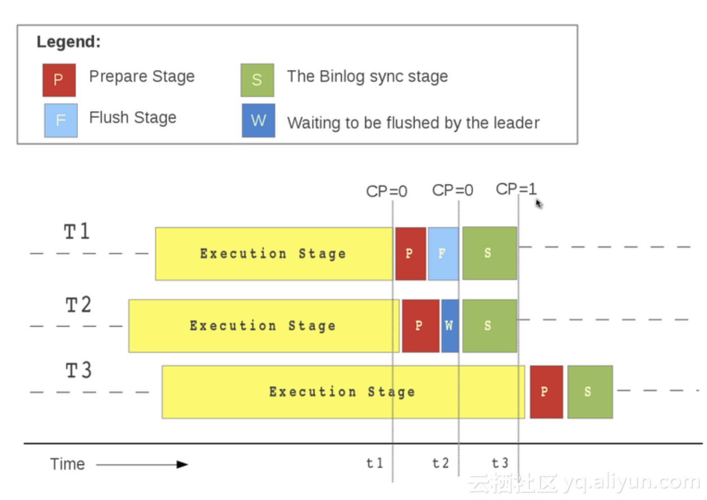

# MySQL5.7 核心技术揭秘：MySQL Group Commit-云栖社区-阿里云

## MySQL5.7 核心技术揭秘：MySQL Group Commit

[兰春](https://yq.aliyun.com/users/zd3c4r4c6g55w) 2018-07-25 09:17:18 浏览2527

*   [云栖社区](https://yq.aliyun.com/tags/type_blog-tagid_1/)
*   [数据存储与数据库](https://yq.aliyun.com/tags/type_blog-tagid_6/)
*   [系统研发与运维](https://yq.aliyun.com/tags/type_blog-tagid_7/)
*   [mysql](https://yq.aliyun.com/tags/type_blog-tagid_389/)
*   [innodb](https://yq.aliyun.com/tags/type_blog-tagid_390/)
*   [日志](https://yq.aliyun.com/tags/type_blog-tagid_467/)
*   [binlog](https://yq.aliyun.com/tags/type_blog-tagid_2169/)
*   [磁盘](https://yq.aliyun.com/tags/type_blog-tagid_2213/)
*   [Group](https://yq.aliyun.com/tags/type_blog-tagid_2291/)
*   [Commit](https://yq.aliyun.com/tags/type_blog-tagid_2292/)

## 一、大纲

*   一阶段提交
*   二阶段提交
*   三阶段提交
*   组提交总结

## 二、一阶段提交

### 2.1 什么是一阶段提交

先了解下含义，其实官方并没有定义啥是一阶段，这里只是我为了上下文和好理解，自己定义的一阶段commit流程。

好了，这里的一阶段，其实是针对MySQL没有开启binlog为前提的，因为没有binlog，所以MySQL commit的时候就相对简单很多。



解释几个概念：

*   execution state做什么事情呢

```plain
在内存修改相关数据，比如：DML的修改
```

*   prepare stage做什么事情呢

```sql
1. write() redo  日志
    1.1 最重要的操作，记住这个时候就开始刷新redo了（依赖操作系统sync到磁盘），很多同学在这个地方都不太清楚，以为flush redo在最后commit阶段才开始
    1.2 这一步可以进行多事务的prepare，也就意味着可以多redo的flush，sync到磁盘，这里是redo的组提交. 在此说明MySQL5.6+ redo是可以进行组提交的，之后我们讨论的重点是binlog，就不在提及redo的组提交了
2. 更新undo状态
3. 等等
```

*   innodb commit stage做什么事情呢

```markdown
1. 更新undo的状态
2. fsync redo & undo(强制sync到磁盘)
3. 写入最终的commit log，代表事务结束
4. 等等
```

由于这里面只对应到redo日志，所以我们称之为一阶段commit

### 2.2 为什么要有一阶段提交

一阶段提交，主要是为了crash safe。

*   如果在 execution stage mysql crash

```perl
当MySQL重启后，因为没有记录redo，此事务回滚
```

*   如果在 execution stage mysql crash

```perl
当MySQL重启后，因为没有记录redo，此事务回滚
```

*   如果 prepare stage

```perl
1. redo log write()了，但是还没有fsync()到磁盘前，mysqld crash了
    此时：事务回滚

2. redo log write()了，fsync()也落盘了，mysqld crash了
    此时：事务还是回滚
```

*   如果 commit stage

```sql
1. commit log fsync到磁盘了
    此时：事务提交成功，否则事务回滚
```

### 2.3 一阶段提交的弊端

缺点也很明显：

*   缺点一

```markdown
1. 为什么redo fsync到磁盘后，还是要回滚呢？
```

*   缺点二

```markdown
1. 没有开启binlog，性能非常高，但是binlog是用来搭建slave的，否则就是单节点，不适合生产环境
```

## 三、二阶段提交

### 3.1 什么是二阶段提交



继续解释几个概念：

*   execution state做什么事情呢

```plain
在内存修改相关数据，比如：DML的修改
```

*   prepare stage做什么事情呢

```perl
1. write() redo  日志  --最重要的操作，记住这个时候就开始刷新redo了（依赖操作系统sync到磁盘），很多同学在这个地方都不太清楚，以为flush redo在最后commit阶段才开始
2. 更新undo状态
3. 等等
```

*   binlog stage做什么事情呢

```sql
1. write binlog
    flush binlog 内存日志到磁盘缓存
2. fsync binlog
    sync磁盘缓存的binlog日志到磁盘持久化
```

*   innodb commit stage做什么事情呢

```markdown
1. 更新undo的状态
2. fsync redo & undo(强制sync到磁盘)
3. 写入最终的commit log，代表事务结束
4. 等等
```

由于这里的流程中包含了binlog和redo日志刷新的协调一致性，我们称之为二阶段

### 3.2 为什么要有二阶段提交

当binlog开启的情况下，我们需要引入另一套流程来保证redo和binlog的一致性 ， 以及crash safe，所以我们用这套二阶段来实现

*   在prepare阶段，如果mysqld crash，由于事务未写入binlog且innodb 存储引擎未提交，所以将该事务回滚掉
*   当binlog阶段

```sql
1. binlog flush 到磁盘缓存，但是没有永久fsync到磁盘
    如果mysqld crash，此事务回滚

2. binlog永久fsync到磁盘，但是innodb commit log还未提交
    如果mysqld crash，MySQL 进行recover，从binlog的xid提取提交的事务进行重做并commit，来保证binlog和redo保持一致
```

*   当commit阶段

```sql

 如果innodb commit log已经提交，事务成功结束
```

那为什么要保证redo和binlog的一致性呢？

*   物理热备的问题

1.  多事务中，如果无法保证多事务的redo和binlog一致性，则会有如下问题

```sql
commit提交阶段包含的事情：
    1. prepare
    2. write binlog  & fsync binlog
    3. commit


T1 (---prepare-----write 100[pos1]-------fsync 100--------------------------------------online-backup[pos3:因为热备取的是最近的提交事务位置]-------commit)

T2 (------prepare------write 200[pos2]---------fsync 200------commit)

T3 (-----------prepare-------write 300[pos3]--------fsync 300--------commit)


解析：
    事务的开始顺序： T1 -》T2 -》T3
    事务的提交结束顺序：  T2 -》T3 -》T1
    binlog的写入顺序： T1 -》 T2 -》T3

结论：
    T2 ， T3 引擎层提交结束，T1 fsync binlog 100 也已经结束，但是T1引擎成没有提交成功，所以这时候online-backup记录的binlog位置是pos3（也就是T3提交后的位置）
    如果拿着备份重新恢复slave，由于热备是不会备份binlog的，所以事务T1会回滚掉，那么change master to pos3的时候，因为T1的位置是pos1（在pos3之前），所以T1事务被slave完美的漏掉了
```

1.  多事务中，可以通过三阶段提交（下面一节讲）保证redo和binlog的一致性，则备份无问题. 接下来看一个多事务中，事务日志和binlog日志一致的情况

```sql
commit提交阶段包含的事情：
    1. prepare
    2. write binlog  & fsync binlog
    3. commit


T1 (---prepare-----write 100[pos1]-------fsync 100-------------commit)

T2 (------prepare------write 200[pos2]---------fsync 200----------------online-backup[pos2:因为热备取的是最近的提交事务位置]---commit)

T3 (-----------prepare-------write 300[pos3]--------fsync 300----------------------------------------------------------------------------commit)


解析：
    事务的开始顺序： T1 -》T2 -》T3
    事务的提交结束顺序：  T1 -》T2 -》T3
    binlog的写入顺序： T1 -》 T2 -》T3
    ps：以上的事务和binlog完全按照顺序一致运行

结论：
    T1 引擎层提交结束，T2 fsync binlog 200 也已经结束，但是T2引擎成没有提交成功，所以这时候online-backup记录的binlog位置是pos1（也就是T1提交后的位置）
    如果拿着备份重新恢复slave，由于热备是不会备份binlog的，所以事务T2会回滚掉，那么change master to pos1的时候，因为T1的位置是pos1（在pos2之前），所以T2、T3事务会被重做，最终保持一致
```

总结：

```sql
以上的问题，主要原因是热备份工具无法备份binlog导致的根据备份恢复的slave回滚导致的，产生这样的原因最后还是要归结于最后引擎层的日志没有提交导致
所以，xtrabackup意识到了这一点，最后多了这一步flush no_write_to_binlog engine logs，表示将innodb层的redo全部持久化到磁盘后再进行备份，在通俗的说，就是图例上的T2一定成功后，才会再继续进行拷贝备份
那么如果是这样，图例上的T2在恢复的时候，就不会被回滚了，所以就自然不会丢失事务啦
```

*   主从数据不一致问题

如果redo和binlog不是一致的，那么有可能就是master执行事务的顺序和slave执行事务顺序不一样，那么不一样会导致什么问题呢？  
在一些依赖事务顺序的场景，尤其重要，比如我们看一个例子

master节点提交T1和T2事务按照以下顺序

```markdown
1.  State0: x= 1, y= 1  --初始值

2.  T1: { x:= Read(y);

3.          x:= x+1;

4.          Write(x);

5.          Commit; }


State1: x= 2, y= 1

7.  T2: { y:= Read(x);

8.            y:=y+1;

9.           Write(y);

10.          Commit; }

State2: x= 2, y= 3


以上两个事务顺序在master为 T1 -> T2
最终结果为
    State1: x= 2, y= 1
    State2: x= 2, y= 3
```

如果slave的事务执行顺序与master相反，会怎么样呢？

```markdown
1.  State0: x= 1, y= 1 --初始值

2.  T2: { y:= Read(x);

3.            y:= y+1;

4.            Write(y);

5.            Commit; }

6.
State1: x= 1, y= 2

7.  T1: { x:= Read(y);

8.            x:=x+1;

9.            Write(x);

10.           Commit; }

11.
State2: x= 3, y= 2

以上两个事务顺序在master为 T2 -> T1
最终结果为
    State1: x= 1, y= 2
    State2: x= 3, y= 2
```

结论：

1.  为了保证主备数据一致性，slave节点必须按照同样的顺序执行，如果顺序不一致容易造成主备库数据不一致的风险。
2.  而redo 和 binlog的一致性，在单线程复制下是master和slave数据一致性的另一个保证， 多线程复制需要依赖MTS的设置
3.  所以，MySQL必须要保证redo 和 binlog的一致性，也就是：引擎层提交的顺序和server层binlog fsync的顺序必须一致，那么二阶段提交就是这样的机制

### 3.3 二阶段提交的弊端

二阶段提交能够保证同一个事务的redo和binlog的顺序一致性问题，但是无法解决多个事务提交顺序一致性的问题

## 四、三阶段提交

### 4.1 什么是三阶段提交



继续解释几个概念：

*   execution state做什么事情呢

```plain
在内存修改相关数据，比如：DML的修改
```

*   prepare stage做什么事情呢

```perl
1. write() redo  日志  --最重要的操作，记住这个时候就开始刷新redo了（依赖操作系统sync到磁盘），很多同学在这个地方都不太清楚，以为flush redo在最后commit阶段才开始
2. 更新undo状态
3. 等等
```

*   binlog stage做什么事情呢

```sql
1. write binlog  --一组有序的binlog
    flush binlog 内存日志到磁盘缓存
2. fsync binlog  --一组有序的binlog
    sync磁盘缓存的binlog日志到磁盘持久化
```

*   innodb commit stage做什么事情呢

```markdown
1. 更新undo的状态
2. fsync redo & undo(强制sync到磁盘)
3. 写入最终的commit log，代表事务结束  --一组有序的commit日志,按序提交
4. 等等
```

这里将整个事务提交的过程分为了三个大阶段

```sql
InnoDB, Prepare
    SQL已经成功执行并生成了相应的redo日志
Binlog, Flush Stage(group)  -- 一阶段
    写入binlog缓存；
Binlog, Sync Stage(group)  -- 二阶段
    binlog缓存将sync到磁盘
InnoDB, Commit stage(group) -- 三阶段
    leader根据顺序调用存储引擎提交事务；


重要参数：

binlog_group_commit_sync_delay=N ： 等待N us后，开始刷盘binlog
binlog_group_commit_sync_no_delay_count=N : 如果队列的事务数达到N个后，就开始刷盘binlog
```

### 4.2 为什么要有三阶段提交

目的就是保证多事务之间的redo和binlog顺序一致性问题, 以及加入组提交机制，让redo和binlog都可以以组的形式（有序集合）进行fsync来提高并发性能

### 4.3 再来聊聊MySQL组提交

#### 队列相关



#### 组提交举例



（一）、T1事务第一个进入第一阶段 FLUSH ， 由于是第一个，所以是leader，然后再等待（按照具体算法）  
（二）、T2事务第二个进行第一阶段 FLUSH ， 由于是第二个，所以是follower，然后等待leader调度  
（三）、FLUSH队列等待结束后，开始进入下一阶段SYNC阶段，此时T1带领T2进行一次fsync操作,之后进入commit阶段，按序提交完成，这就是一次组提交的简要过程了  
（四）、prepare可以并行，说明两个事务没有任何冲突。有冲突的prepare无法进行进入同一队列  
（五）、每个队列之间都是可以并行运行的

## 五、总结

*   组提交的核心思想就是：一次fsync（）调用，可以刷新N个事务的redo log(redo的组提交) & binlog(binlog的组提交)
*   组提交的最终目的就是为了减少IO的频繁刷盘，来提高并发性能,当然也是之后多线程复制的基础
*   组提交中：sync\_binlog=1 & innodb\_trx\_at\_commit=1 代表的不再是1个事务，而是一组事务和一个事务组的binlog
*   组提交中：binlog是顺序fsync的，事务也是按照顺序进行提交的，这都是有序的，MySQL5.7 并对这些有序的事务进行打好标记（last\_committed，sequence\_number ）

### 六、思考问题

*   如何保证slave执行的同一组binlog的事务顺序跟master的一致
    
    ```plain
    如果slave上同一组事务中的后面的事务先执行，那么slave的gtid该如何表示
    如何保证slave上同一组事务中的事务是按照顺序执行的
    ```
    
*   如果slave突然挂了，那么执行到一半的一组事务，是全部回滚？还是部分回滚？
    
    ```plain
    如果是部分回滚，那么如何知道哪些回滚了，哪些没有回滚，mysql如何自动修复掉回滚的那部分事务
    ```
    

版权声明：本文内容由互联网用户自发贡献，版权归作者所有，本社区不拥有所有权，也不承担相关法律责任。如果您发现本社区中有涉嫌抄袭的内容，欢迎发送邮件至：[yqgroup@service.aliyun.com](mailto:yqgroup@service.aliyun.com) 进行举报，并提供相关证据，一经查实，本社区将立刻删除涉嫌侵权内容。

### 网友评论

[登录](https://account.aliyun.com/login/login.htm?from_type=yqclub&oauth_callback=https%3A%2F%2Fyq.aliyun.com%2Farticles%2F618471%3Futm_content%3Dm_1000008698%26do%3Dlogin)后评论

0/500

评论

 [](https://yq.aliyun.com/users/7jeoozvcbpwsi) 

[1957436195831984](https://yq.aliyun.com/users/7jeoozvcbpwsi) 2019-03-07 09:33:27

老师，这个组提交有参数控制吗，能从日志里面看出来吗

[0](#modal-login "赞") [0](#modal-login "评论")

### 相关文章

[](https://yq.aliyun.com/articles/708021)

5.7新特性之多线程复制

[梓杰](https://yq.aliyun.com/users/k5fbrebkyhlei) 2019-07-08 09:43:12 浏览3068

[](https://yq.aliyun.com/articles/364921)

深入理解MySQL 5.7 GTID系列（三）：GTID的生成时机

[技术小能手](https://yq.aliyun.com/users/o3u4mvu6rfxm2) 2018-01-15 17:40:39 浏览3115

[](https://yq.aliyun.com/articles/555103)

MySQL group replication介绍

[技术小甜](https://yq.aliyun.com/users/qkixv43wa7m4w) 2017-11-16 12:04:00 浏览1438

[](https://yq.aliyun.com/articles/621197)

MySQL并行复制的深入浅出

[兰春](https://yq.aliyun.com/users/zd3c4r4c6g55w) 2018-08-01 20:13:49 浏览4305

[](https://yq.aliyun.com/articles/71915)

MySQL · 特性分析 ·MySQL 5.7新特性系列四

[db匠](https://yq.aliyun.com/users/2tvzw6252h6m2) 2017-03-08 10:48:33 浏览1823

[](https://yq.aliyun.com/articles/555115)

mysql5.7新增参数配置解释

[技术小甜](https://yq.aliyun.com/users/qkixv43wa7m4w) 2017-11-24 12:07:00 浏览1039

[](https://yq.aliyun.com/articles/422834)

MySQL · 特性分析 · LOGICAL_CLOCK 并行复制原理及实现分析

[技术小能手](https://yq.aliyun.com/users/o3u4mvu6rfxm2) 2018-02-02 13:16:24 浏览1311

[](https://yq.aliyun.com/articles/228198)

POLARDB云数据库分布式存储引擎揭秘

[场景研读](https://yq.aliyun.com/users/jhhbjgfv7lddy) 2017-10-27 19:37:26 浏览4086

[](https://yq.aliyun.com/articles/281250)

MySQL · 特性分析 · MySQL 5.7 外部XA Replication实现及缺陷分析

[技术小能手](https://yq.aliyun.com/users/o3u4mvu6rfxm2) 2017-12-13 17:04:10 浏览1829

[](https://yq.aliyun.com/articles/341325)

深入理解MySQL 5.7 GTID系列（二）：GTID相关内部数据结构

[技术小能手](https://yq.aliyun.com/users/o3u4mvu6rfxm2) 2018-01-10 10:26:24 浏览2725

[](https://yq.aliyun.com/articles/482829)

MySQL5.6.26升级到MySQL5.7.9实战方案

[科技小能手](https://yq.aliyun.com/users/gtdqzn4uqwgsg) 2017-11-12 14:34:00 浏览1251

[](https://yq.aliyun.com/articles/513104)

mysql5.7 主从

[技术小阿哥](https://yq.aliyun.com/users/grng7az2sxifq) 2017-11-27 15:39:00 浏览582

[](https://yq.aliyun.com/articles/515579)

MySQL5.7配置参数

[科技小能手](https://yq.aliyun.com/users/gtdqzn4uqwgsg) 2017-11-12 14:08:00 浏览654

[](https://yq.aliyun.com/articles/595940)

Innodb检查点和redo写盘时机

[重庆八怪](https://yq.aliyun.com/users/7c54npjb2zdg4) 2018-05-22 18:23:36 浏览1061

[](https://yq.aliyun.com/articles/600576)

MySQL：一个简单insert语句的大概流程

[重庆八怪](https://yq.aliyun.com/users/7c54npjb2zdg4) 2018-06-07 17:32:39 浏览3164

[](https://yq.aliyun.com/articles/615492)

POLARDB云数据库分布式存储引擎揭秘,POLARDB和MySql 5.6兼容性能对比

[幸运码发放](https://yq.aliyun.com/users/iqyoy6msq3ji4) 2018-07-19 16:03:10 浏览1988

[](https://yq.aliyun.com/articles/629396)

MySQL：Innodb恢复的学习笔记

[重庆八怪](https://yq.aliyun.com/users/7c54npjb2zdg4) 2018-08-27 15:45:59 浏览1375

[](https://yq.aliyun.com/articles/653654)

MySQL:Innodb:innodb\_flush\_log\_at\_trx_commit参数影响的位置

[重庆八怪](https://yq.aliyun.com/users/7c54npjb2zdg4) 2018-10-17 18:56:31 浏览1444

[](https://yq.aliyun.com/articles/675220)

MySQL：Innodb 关于Handler_commit每次DML增加2的原因

[重庆八怪](https://yq.aliyun.com/users/7c54npjb2zdg4) 2018-12-05 17:40:17 浏览1309

[](https://yq.aliyun.com/articles/727818)

十五：MySQL层事务提交流程简析（笔记）

[重庆八怪](https://yq.aliyun.com/users/7c54npjb2zdg4) 2019-11-22 12:00:35 浏览305

[](https://yq.aliyun.com/articles/623252)

MySQL:FLTWL的堵塞和被堵塞总结

[重庆八怪](https://yq.aliyun.com/users/7c54npjb2zdg4) 2018-08-07 17:15:09 浏览1686

[](https://yq.aliyun.com/articles/557559)

CentOS6.9编译安装MySQL5.7.16

[余二五](https://yq.aliyun.com/users/fy5hholq4xfqs) 2017-11-15 22:07:00 浏览882

[](https://yq.aliyun.com/articles/710528)

MySQL 5.7和8.0性能测试

[幸运券发放](https://yq.aliyun.com/users/ekb47czrqvgrq) 2019-07-24 12:34:52 浏览1328

[](https://yq.aliyun.com/articles/500194)

MySQL 5.7.17 Group Replication搭建

[科技小能手](https://yq.aliyun.com/users/gtdqzn4uqwgsg) 2017-11-12 15:48:00 浏览923

[](https://yq.aliyun.com/articles/328559)

阿里云主机centos7.2上安装二进制mysql5.7

[proinsightio](https://yq.aliyun.com/users/nmbtdzlsfn73c) 2018-01-03 12:50:05 浏览1195

[](https://yq.aliyun.com/articles/401268)

MySQL Group Replication调研剖析

[技术小胖子](https://yq.aliyun.com/users/bnch2y3za6tla) 2017-11-09 15:34:00 浏览1324

[](https://yq.aliyun.com/articles/555117)

MySQL5.7新特性——gtid基础

[技术小甜](https://yq.aliyun.com/users/qkixv43wa7m4w) 2017-11-09 12:08:00 浏览905

[](https://yq.aliyun.com/articles/550355)

MySQL5.7多实例自动化部署脚本

[技术小胖子](https://yq.aliyun.com/users/bnch2y3za6tla) 2017-11-15 18:12:00 浏览905

[](https://yq.aliyun.com/articles/555116)

MySQL5.7.16 gtid复制

[技术小甜](https://yq.aliyun.com/users/qkixv43wa7m4w) 2017-11-15 12:07:00 浏览713

[](https://yq.aliyun.com/articles/652504)

MySQL主从延时这么长，要怎么优化？

[技术小能手](https://yq.aliyun.com/users/o3u4mvu6rfxm2) 2018-10-15 10:12:23 浏览2328

[](https://yq.aliyun.com/articles/448895)

MySQL5.7多实例自动化部署脚本

[科技小能手](https://yq.aliyun.com/users/gtdqzn4uqwgsg) 2017-11-07 15:44:00 浏览846

[](https://yq.aliyun.com/articles/555120)

MySQL5.7.18 for Linux7.2 源码安装

[技术小甜](https://yq.aliyun.com/users/qkixv43wa7m4w) 2017-11-16 12:09:00 浏览762

[](https://yq.aliyun.com/articles/503763)

centos7和centos6.5环境rpm方式安装mysql5.7和mysql5.6详解

[科技小能手](https://yq.aliyun.com/users/gtdqzn4uqwgsg) 2017-11-12 01:32:00 浏览2302

[](https://yq.aliyun.com/articles/531757)

MySQL 中的重做日志，回滚日志以及二进制日志的简单总结

[it_风信子](https://yq.aliyun.com/users/txgx22eyr4ycm) 2018-03-12 17:29:19 浏览8980

[](https://yq.aliyun.com/articles/408951)

深入理解MySQL 5.7 GTID系列(五) gtid\_executed>id\_purged什么时候更新

[技术小能手](https://yq.aliyun.com/users/o3u4mvu6rfxm2) 2018-01-29 10:29:10 浏览1926

[](https://yq.aliyun.com/articles/496820)

MYSQL5.7版本sql\_mode=only\_full\_group\_by问题

[技术小胖子](https://yq.aliyun.com/users/bnch2y3za6tla) 2017-11-09 18:06:00 浏览2951

[](https://yq.aliyun.com/articles/515324)

MySQL 5.7 LOGICAL_CLOCK 并行复制原理及实现分析

[勉仁](https://yq.aliyun.com/users/wnvrk4fdhp2nu) 2018-03-07 11:38:18 浏览1891

[](https://yq.aliyun.com/articles/713339)

MySQL主从延时这么长，要怎么优化？

[初商](https://yq.aliyun.com/users/wwlhfnsnf6wb6) 2019-08-08 23:59:26 浏览732

[](https://yq.aliyun.com/articles/755128)

揭秘MySQL生态重要功能，X-Engine引擎核心能力——OnlineDDL

[skin778](https://yq.aliyun.com/users/dq4uolquh4tsu) 2020-04-14 17:17:41 浏览289

[](https://yq.aliyun.com/articles/755895)

揭秘MySQL生态重要功能，X-Engine引擎核心能力——OnlineDDL

[skin778](https://yq.aliyun.com/users/dq4uolquh4tsu) 2020-04-17 17:58:48 浏览354

下拉加载更多

---------------------------------------------------


原网址: [访问](https://yq.aliyun.com/articles/618471?utm_content=m_1000008698)

创建于: 2020-04-29 21:43:44

目录: default

标签: `yq.aliyun.com`

