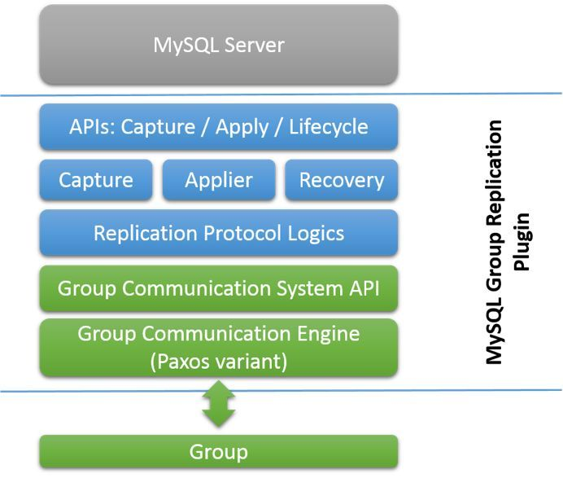
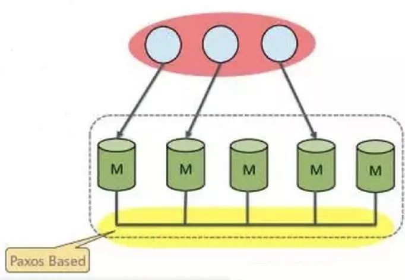
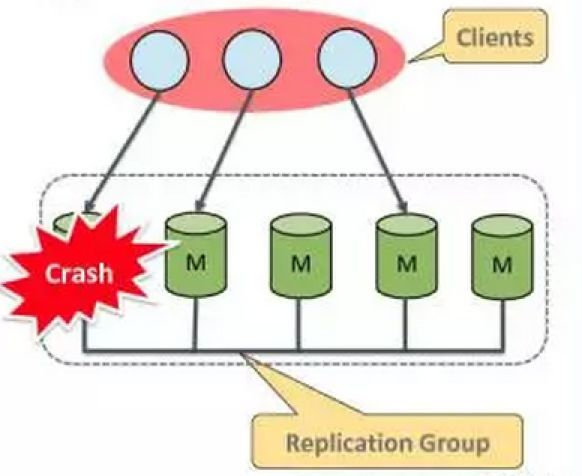

# Mysql Group Replication简介

2019-09-10阅读 1.4K0

MGR（[Mysql](https://cloud.tencent.com/product/cdb?from=10680) Group Replication）是5.7版本新加的特性，是一个MySQL插件。

MGR 是一个新的高可用与高扩展的方案，集群中的任何节点数据都是一样的，可以实现任何节点都可以写入，实现了真正意义上的多主。



**主要包含以下几部分**

API层：负责完成和My[SQL Server](https://cloud.tencent.com/product/sqlserver?from=10680)的交互，得到Server状态，完成事务的管理。

组件层：主要包括3个特定组件，Capture负责收集事务执行的相关信息，Applier负责应用集群事务到本地，Recovery负责节点的数据恢复。

复制层：负责冲突验证，接收和应用集群事务。

集群通信层：基于Paxos协议的集群通信引擎，以及和上层组件的交互接口**。**

**实现原理**

MGR实现分布式数据库架构，底层的分布式基础是Paxos。通过Paxos来保证分布式数据库系统中事务的提交顺序。



每次一个事务在一个节点提交的时候，就会发送所修改的数据到所有节点，检查此期间是否有修改冲突（比如修改了别的节点已经修改并提交成功的事务的数据），如果发现冲突，本事务回滚。如果没有冲突，则可以直接提交成功。

对于非执行事务的远程节点，如果事务判断为执行成功，远程发送过来的数据，会被保存在本地的一个relaylog里面（注意，与常规主从同步使用的relaylog不是同一组），之后由从库的applier线程采用正常主从同步（目前已经支持LOGICAL\_CLOCK并行执行）的方式执行掉对应的relaylog。

这里有一个临界点，如果一个事务刚刚被写入relaylog，还没有来得及执行掉，这时候有一个事务的执行涉及了相关的数据，那么后来的这个事务在执行阶段可以执行成功，但是必定会在提交阶段失败的。

**失败节点检测** 只有认为无法连接的节点才会从集群中自动踢走。 机制如下： 不可用本身的发现，是依赖消息通讯的超时决定的。即如果节点对另外的节点的消息发送超时，则认为远程节点不可用。 对于正常节点，如果认为一个其他节点不可用了，首先会标记为不可用，之后与其他节点沟通，如果确认这个节点确实其他节点都认为不可用，则实际设置为不可用节点。 如果一个节点发现本身连接不到其他所有的实例（认为其他节点全部死亡），则这个节点本身之后的事务执行，就不会采用分布式算法而是退回传统的单节点事务模式。 另外，如果同时失败节点数过多（超过一半），为了避免脑裂，分布式算法会拒绝运行，需要人工介入恢复，这也是需要注意的一点。



**失败恢复** 这里说的，主要把一个节点，加入到已有集群的过程，而非单实例的崩溃恢复。 第一阶段，新实例选择集群中的一个实例作为种子实例，这个种子实例会发送所有新实例到加入集群为止缺失的日志数据到新实例，这个过程，是通过简单的主从同步日志的方式做的。执行第一阶段期间，新实例还会一直持续接收当前正在活跃（实例加入集群后）的事务的日志，补全从种子实例没有传输的增量日志。当种子实例传输日志完成之后，第一阶段就完毕了。这一阶段，如果种子实例出现问题崩溃或者失败了，新实例会自动选取实例里面别的实例替代。 第二阶段，新实例合并之前的活跃事务到当前数据库，当残余的事务量接近0（新事务一直在别的实例发生，只能非常接近0而很难完全追上）的时候，实例在集群中的状态，就会被修改为ONLINE了。

**流量控制** MySQL的GR，全局所有的实例都拥有所有的数据，也实际上需要运行所有的写入流量，如果有某一个实例相对较慢，如果时间持续下去，这个节点可能出现延迟，极端情况下，可能越追越远。 流量控制试图做到的事情是，保障整个集群节点之间，最快的节点和最慢的节点之间的事务差距不要太大。 实际需要控制的，有两个队列，一个是事务提交时候的冲突检查队列，一个是事务实际执行的relay日志队列。

**DDL执行** DDL先天上并不支持事务化，也就是多节点执行的时候，如果有几个节点失败，并不会导致已经执行成功的节点回滚DDL，对于DDL的执行结果需要单独验证，以避免多节点表不一致。

**IP白名单** 这个主要是安全方面的考虑，只允许指定来源的ip作为复制节点与集群通讯。

**限制** 所有涉及的数据都必须发生在InnoDB存储引擎的表内。 所有的表必须有明确的主键定义。 网络地址只支持IPv4。 需要低延迟，高带宽的网络。 目前集群限制最多允许9个节点。 必须启用binlog。 binlog 格式必须是row格式。 必须打开gtid模式。 复制相关信息必须使用表存储。 事务写集合（Transaction write set extraction）必须打开。（这个目前与savepoint冲突，这也是导致mysqldump无法备份GR实例的原因） log slave updates必须打开。 binlog的checksum目前不支持。 由于事务写集合的干扰，无法使用savepoint。 SERIALIZABLE 隔离级别目前不支持。 对同一个对象，在集群中不同的实例上，并行地执行DDL（哪怕是相互冲突的DDL）是可行的，但会导致数据一致性等方面的错误，目前阶段不支持在多节点同时执行同一对象的DDL。 外键的级联约束操作目前的实现并不完全支持，不推荐使用。

**节点状态** ONLINE 节点状态正常，可以正常执行事务 RECOVERING 正在接收种子节点的日志 OFFLINE 节点之前注册了，但并不属于当前集群（可能节点已经失败） ERROR 恢复阶段，阶段1或者阶段2失败 UNREACHABLE 节点不可达，一般出现在通讯超时的情况

**几个名词** Donor：用于节点恢复时候，传输历史binlog的节点。

Group Configuration：集群里已经配置的实例列表。

Group Membership Service：维护一致性view变更的服务，作用于节点的新增，退出，以及当前视图的维护工作。

Joiner：将要加入到集群但状态尚未恢复到ONLINE的新节点。

Seed：负责触发新节点加入集群动作的实例。

View：当前集群活跃实例的列表。

**模式**

单主模式：

在此模式下，组有一个设置为读写模式的单主server。 组中的所有其他成员被自动设置为只读模式（超级只读模式）。主服务器通常是用于引导组的第一个server，所有其他加入的server自动从主服务器同步并设置为只读。

optiongroup\_replication\_enforce\_update\_everywhere\_checks=FALSE

多主模式：

在多主模式下，没有单主模式的概念。没有必要使用选主程序，因为不同server成员之间没有 什么特殊的差异。

group\_replication\_enforce\_update\_everywhere\_checks=ON #非必需，但强烈建议 group\_replication\_single\_primary\_mode=OFF #必须，表示关闭单主模型，即使用多主

**参数配置**

binlog-checksum=NONE #禁止mysql向binlog中写入checksum

plugin-load = group\_replication.so #加载Group Replication 插件

transaction-write-set-extraction = XXHASH64 #使用算法将其编码为散列

group\_replication\_start\_on\_boot = OFF #控制当前节点是否随MySQL启动，自动启动组复制

Group Replicationgroup\_replication\_bootstrap\_group = OFF #搭建GR时第一个节点设置为ON，其余节点为OFF

group\_replication\_group\_name = 550fa9ee-a1f8-4b6d-9bfe-c03c12cd1c72 #GR名称，格式为UUID格式

group\_replication\_local\_address ='1.1.1.1:3306' #本地节点IP端口，接受组中其他成员传入连接

group\_replication\_group\_seeds ='1.1.1.1:3306,1.1.1.2:3306' #本组中的其他节点列表

group\_replication\_ip\_whitelist ='1.1.1.3,1.1.1.4' #白名单 **命令** 引导节点： SET SQL\_LOG\_BIN=0; CREATE USER replicater@'%'; GRANT REPLICATION SLAVE ON \*.\* TO replicater@'%' IDENTIFIED BY ‘xxx'; FLUSH PRIVILEGES; SET SQL\_LOG\_BIN=1; CHANGE MASTER TO MASTER\_USER='replicater', MASTER\_PASSWORD=‘xxx' FOR CHANNEL 'group\_replication\_recovery'; SET GLOBAL group\_replication\_bootstrap\_group=ON; START GROUP\_REPLICATION; SET GLOBAL group\_replication\_bootstrap\_group=OFF; 其他节点： SET SQL\_LOG\_BIN=0; CREATE USER replicater@'%'; GRANT REPLICATION SLAVE ON \*.\* TO replicater@'%' IDENTIFIED BY ‘xxx'; FLUSH PRIVILEGES; SET SQL\_LOG\_BIN=1; CHANGE MASTER TO MASTER\_USER='replicater', MASTER\_PASSWORD=‘xxx' FOR CHANNEL 'group\_replication\_recovery'; START GROUP\_REPLICATION; **部署**

```javascript
mysql> SET SQL_LOG_BIN=0; 
Query OK, 0 rows affected (0,00 sec)  
mysql> CREATE USER rpl_user@'%'; 
Query OK, 0 rows affected (0,00 sec)  
mysql> GRANT REPLICATION SLAVE ON *.* TO rpl_user@'%' IDENTIFIED BY 'rpl_pass'; 
Query OK, 0 rows affected, 1 warning (0,00 sec)  
mysql> FLUSH PRIVILEGES; 
Query OK, 0 rows affected (0,00 sec)  
mysql> SET SQL_LOG_BIN=1; 
Query OK, 0 rows affected (0,00 sec)
```

用户进行上述配置后，需要使用CHANGE MASTER TO语句将server配置为复制通道，在下次需要从其他成员恢复其状态时，使用group\_replication\_recovery复制通道的给定凭据。执行以下命令，将rpl\_user和rpl\_pass替换为创建用户时使用的值。

```javascript
mysql> CHANGE MASTER TO MASTER_USER='rpl_user', MASTER_PASSWORD='rpl_pass' FOR CHANNEL 'group_replication_recovery'; 
Query OK, 0 rows affected, 2 warnings (0,01 sec)
```

分布式恢复是加入组的server执行的第一步。如果未正确设置这些凭据，server将无法执行恢复过程并获得与其他组成员同步，因此最终将无法加入组。类似地，如果成员无法通过server的主机名正确识别其他成员，则恢复过程可能会失败。

**安装组复制插件**

```javascript
mysql> CHANGE MASTER TO MASTER_USER=INSTALL PLUGIN group_replication SONAME 'group_replication.so';
```

**启动组复制**

此引导只启动一次，不能写到配置文件，避免重启后启动多次重复。

```javascript
mysql> CHANGE MASTER TO MASTER_USER=SET GLOBAL group_replication_bootstrap_group=ON;
mysql> CHANGE MASTER TO MASTER_USER=START GROUP_REPLICATION; 
mysql> CHANGE MASTER TO MASTER_USER=SET GLOBAL group_replication_bootstrap_group=OFF;
```

**查看组成员**

```javascript
mysql> SELECT * FROM performance_schema.replication_group_members;
```

**添加组成员**

操作步骤同上，只是不执行SET GLOBAL group\_replication\_bootstrap\_group = ON的操作; 在启动组复制之前，因为该组已由第一个server创建和引导。此时，server2只需要添加到已经存在的组中。

```javascript
mysql> START GROUP_REPLICATION; 
Query OK, 0 rows affected (44,88 sec)
```

**组复制信息查看**

在performance\_schema库下如下表可查看相关信息：

replication\_group\_member\_stats

replication\_group\_members

replication\_connection\_status

replication\_applier\_status

**问题**

1、不建议开启多主模式，如果在一台server执行DDL，未完全同步，又在其他server执行事务，可能造成数据不一致。

2、必须开启GTID模型是为了保证让事务具有唯一的事务ID，在组内传播出去后不会重复执行。

3、表中必须有主键是为了冲突检测。

4、组复制建议使用READ COMMITTED隔离级别。在READ COMMITTED隔离级别中，InnoDB基本上不会使用Gap Locks，这将使得InnoDB自带的冲突探测能和组复制的冲突探测相互对齐从而保持一致。

5、在实际线上环境基本不可能保留全部的binlog，故在添加一个新节点时需要使用比较新的备份先恢复数据，才能加入到组中。

本文分享自微信公众号 - MYSQL轻松学（learnmysql），作者：Liang

原文出处及转载信息见文内详细说明，如有侵权，请联系 yunjia\_community@tencent.com 删除。

原始发表时间：2019-09-06

本文参与[腾讯云自媒体分享计划](https://cloud.tencent.com/developer/support-plan)，欢迎正在阅读的你也加入，一起分享。

[其他](https://cloud.tencent.com/developer/tag/125?entry=article)[分布式数据库](https://cloud.tencent.com/developer/tag/10393?entry=article)[分布式](https://cloud.tencent.com/developer/tag/10668?entry=article)[MySQL](https://cloud.tencent.com/developer/tag/10245?entry=article)[SQL](https://cloud.tencent.com/developer/tag/10253?entry=article)

[举报](javascript:)

点赞 4分享

### 我来说两句

0 条评论

[登录](javascript:) 后参与评论

---------------------------------------------------


原网址: [访问](https://cloud.tencent.com/developer/article/1501860)

创建于: 2020-09-14 17:14:08

目录: default

标签: `cloud.tencent.com`

