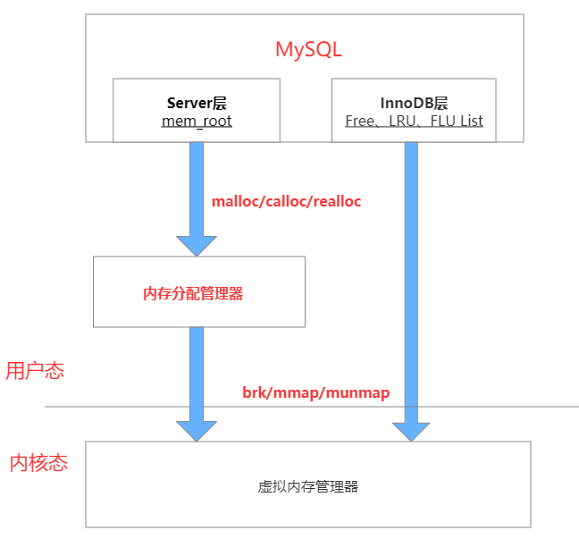

# 技术分享 | MySQL 内存管理初探

2020-10-22阅读 1550

作者：xuty

本文来源：原创投稿 \*爱可生开源社区出品，原创内容未经授权不得随意使用，转载请联系小编并注明来源。

* * *

**一、背景**

经常在项目上碰到在没有**大并发活跃 SQL** 的情况下，MySQL 所占用的物理内存远大于 InnoDB\_Buffer\_Pool 的配置大小。我起初是怀疑被 **performance\_schema 吃掉了**或是 **MySQL 存在内存泄露**，而后发现并非如此。是自己对于 **MySQL** 和 **Linux** 的内存管理不了解所致，因此本篇就来深入讨论下，有何不对或者不严谨的地方欢迎提出~

先简单说下个人对于 MySQL 内存分配的基础认识，可能会存在部分认知偏差：

MySQL 的内存占用主要由两部分组成，**global\_buffers** 与 **all\_thread\_buffers**，其中 **global\_buffers** 为全局共享缓存，**all\_thread\_buffers** 为所有线程独立缓存，如下图所示：


**global\_buffers**：Sharing + InnoDB\_Buffer\_Pool

**all\_thread\_buffers**：max\_threads(当前活跃连接数) \* (Thread memory)

其中 InnoDB\_Buffer\_Pool 是 MySQL 中内存占用中最大的一块，为**常驻内存**，也就说是不会释放，除非 MySQL 进程退出。

而另外一块比较吃内存的就是线程缓存。例如常见的 join\_buffer、sort\_buffer、read\_buffer 等，通常与连接数成正比。即连接数越高，并发越高，线程缓存占用总量就越高，但是这类缓存往往会**随着连接关闭而释放**，并非常驻内存。

**二、内存高水位现象**

*   CentOS Linux release 7.3.1611 (Core)
*   Server version: 5.7.27-log MySQL Community Server (GPL)

我们先做个小测试来观察下 MySQL 的内存占用变化，首先关闭 **performance\_schema** 与 **innodb\_buffer\_pool\_load\_at\_startup**，防止造成缓存干扰。然后将 **innodb\_buffer\_pool** 设置 100M，理论上 **innodb\_buffer\_pool** 的最大仅会占用 100M，可以通过 **show engine innodb status \\G** 进行查看。

通过 sysbench 创建一张 100W 的测试表，重启 MySQL，观察目前 MySQL 总共占用了 55536KB 物理内存，其中 **innodb\_buffer\_pool** 中占用了 432\*16K=6912KB 内存，那么我就算 MySQL 默认启动后会占用 50MB 物理内存。

```javascript
UID       PID  minflt/s  majflt/s     VSZ    RSS   %MEM  Command
997     11980      0.00      0.00 1240908  55536   0.69  mysqld

----------------------
BUFFER POOL AND MEMORY
----------------------
Total large memory allocated 107380736
Dictionary memory allocated 116177
Buffer pool size   6400
Free buffers       5960
Database pages     432
```

然后我们开始通过 sysbench 进行 select 压测，从 4 线程开始压测，4-8-16-32-64 逐步加大线程数，每次压测 2min，最后观察 MySQL 总物理内存占用大小变化情况。


从上图可以看到，4 线程刚开始压测的时候，内存占用飙升。主要是由于 **innodb\_buffer\_pool** 中大量涌入数据页造成。而后加大线程数时，由于 **innodb\_buffer\_pool** 已经饱和达到 100M 上限，所以起伏不是很高。这块内存上升的原因主要是由于 all\_thread\_buffers 增大造成，最后 64 线程压测完，MySQL 总物理内存占用稳定在 194MB 左右，并且一直维持着，并没有释放还给操作系统。

压测结束后，再次查看 **innodb\_buffer\_pool**，可以看到 **Free buffers** 为空，100M 已经完全占满。

```javascript
----------------------
BUFFER POOL AND MEMORY
----------------------
Total large memory allocated 107380736
Dictionary memory allocated 120760
Buffer pool size   6400
Free buffers       0
Database pages     5897
Old database pages 2156
```

减去 **innodb\_buffer\_pool** 的 100M，以及 MySQL 刚启动占用的 50M，还有 40MB+ 的内存占用，主要为 **all\_thread\_buffers**。

通过这个测试可以看到，之前所理解的**线程缓存随着连接关闭而释放**其实不太对。MySQL 并不会**把这部分缓存还给操作系统**，而只是在 MySQL 内部释放，然后重复使用。

我把这个现象称为**内存高水位现象**，因为与 Oracle 中高水位线概念非常类似。同样的，MySQL 中当 ibd 文件被撑大后，即使 delete 全表，也不会主动去释放磁盘空间返还给操作系统，而是重复使用已释放的磁盘空间，现象也非常一致。

> PS：这里 sysbench 压测是走主键索引的单表 where 查询，并不会申请 sort\_buffer，join\_buffer 等。所以单个会话申请的线程缓存比较少。因此最后总的线程缓存占用不是非常高，如果是压复杂 SQL，内存占用应该会比较高。

**三、Linux 进程内存分配**

为了搞清楚 MySQL 经常出现**内存高水位现象**的原因，先去查阅学习了 Linux 下相关的内存调用原理，具体内容总结如下：


上图是 **32 位用户虚拟空间内存**的结构简图，由上到下分别是：

1\. 只读段：包括代码和常量等；

2\. 数据段：包括全局变量等；

3\. 堆：包括动态分配的内存，从低地址开始向上增长；

4\. 文件映射段：包括动态库、共享内存等，从高地址开始向下增长；

5\. 栈：包括局部变量和函数调用的上下文等。

其中**堆**与**文件映射段**是我们讨论的重点，它们的内存都是动态分配的。比如说，使用 C 标准库的 **malloc()** 或者 **mmap()** ，就可以分别在**堆**和**文件映射段**动态分配内存。

那么这两者有什么区别呢？

**malloc()** 是 C 标准库提供的内存分配函数，对应到系统调用上，有两种实现方式，即 **brk()** 和 **mmap()**。

**1\. brk 方式**

*   对于小块内存（<128K），C 标准库使用 **brk()** 来分配。也就是通过移动堆顶的位置来分配内存。这些内存释放后并不会立刻归还系统，而是被缓存起来，重复使用。
*   优缺点：brk() 方式可以减少缺页异常的发生，提高内存访问效率。不过，由于这些内存没有归还系统，所以在内存工作繁忙时，频繁的内存分配和释放会造成内存碎片。

**2\. mmap 匿名映射方式**

*   对于大块内存（>128K），C 标准库使用 **mmap()** 来分配，也就是在文件映射段找一块空闲内存分配出去。**mmap()** 方式分配的内存，会在释放时直接归还系统，所以每次 mmap 都会发生缺页异常。
*   优缺点：**mmap()** 方式可以将内存及时返回给系统，避免 OOM。但是工作繁忙时，频繁的内存分配会导致大量的缺页异常，使内核的管理负担增大。这也是 malloc 只对大块内存使用 mmap 的原因。

所谓的**缺页异常**是指进程申请内存后，只分配了虚拟内存。这些所申请的虚拟内存，只有在首次访问时才会分配真正的物理内存，也就是通过缺页异常进入内核中，再由**内核**来分配物理内存（本质就是建立虚拟内存与物理内存的地址映射）。

*   brk() 方式申请的**堆内存**由于释放内存后并不会归还给系统，所以下次申请内存时，并不需要发生缺页异常。
*   mmap() 方式申请的动态内存会在释放内存后直接归还系统，所以下次申请内存时，会发生缺页异常（增加内核态 CPU 开销）。

C 语言跟内存申请相关的函数主要有 calloc, malloc, realloc 等。

*   malloc：根据内存申请大小，选择在堆或文件映射段中分配连续内存，但是不会初始化内存，一般会再通过 memset 函数来初始化这块内存。
*   calloc：与 malloc 类似，只不过会自动初始化这块内存空间，每个字节置为 0。
*   realloc：可以对已申请的内存进行大小调整，同 malloc 一样新申请的内存也是未初始化的。

**四、Linux 内存分配器**

上述所说的是 Linux 进程通过 C 标准库中的内存分配函数 malloc 向系统申请内存，但是到真正与内核交互之间，其实还隔了一层，即**内存分配管理器(memory allocator)**。常见的内存分配器包括：ptmalloc(Glibc)、tcmalloc(Google)、jemalloc(FreeBSD)。MySQL 默认使用的是 glibc 的 ptmalloc 作为内存分配器。


内存分配器采用的是**内存池**的管理方式，处在用户程序层和内核层之间，它响应用户的分配请求，向操作系统申请内存，然后将其返回给用户程序。

为了保持高效的分配，分配器通常会预先向操作系统申请一块内存，当用户程序申请和释放内存的时候，分配器会将这些内存管理起来，并通过一些算法策略来判断是否将其返回给操作系统。这样做的最大好处就是可以避免用户程序频繁的调用系统来进行内存分配，使用户程序在内存使用上更加高效快捷。

关于 ptmalloc 的内存分配原理，个人也不是非常了解，这里就不班门弄斧了，有兴趣的同学可以去看下华庭的《glibc 内存管理 ptmalloc 源代码分析》【文末链接】。

关于如何选择这三种内存分配器，网上资料大多都是推荐摒弃 glibc 原生的 ptmalloc，而改用 jemalloc 或者 tcmalloc 作为默认分配器。因为 ptmalloc 的主要问题其实是内存浪费、内存碎片、以及加锁导致的性能问题，而 jemalloc 与 tcmalloc 对于内存碎片、多线程处理优化的更好。


目前 jemalloc 应用于 Firefox、FaceBook 等，并且是 [MariaDB](https://cloud.tencent.com/product/tdsql?from=10680)、[Redis](https://cloud.tencent.com/product/crs?from=10680)、Tengine 默认推荐的内存分配器，而 tcmalloc 则应用于 WebKit、Chrome 等。

**总体来说，MySQL 下更推荐使用 jemalloc 作为内存分配器，可以有效解决内存碎片与提高整体性能，有兴趣的同学可以进一步测试下，本篇就不深入探究了。**

**五、MySQL 内存管理**

> Server version: 5.7.27-log MySQL Community Server (GPL)

接着我们再来看下 MySQL 内部是管理内存的，查阅大量资料后，发现我原先的理解不是很正确，之前我习惯性的把 MySQL 的内存划分为 Innodb\_buffer\_pool、Sharing 、Thread memory 等三大类，但实际应该以 MySQL 的架构来划分内存管理比较合理。即 **Server 层**与 **InnoDB 层（Engine 层）**，而这两块内存是由不同的方式进行管理的。

其中 Server 层是由 mem\_root 来进行内存管理，包括 Sharing 与 Thead memory；而 InnoDB 层则主要由 Free List、LRU List、FLU List 等多个链表来统一管理 Innodb\_buffer\_pool。

4.1. Innodb\_buffer\_pool

MySQL 5.7 开始支持 Innodb\_buffer\_pool 动态调整大小，每个 buffer\_pool\_instance 都由同样个数的 chunk 组成，每个 chunk 内存大小为 innodb\_buffer\_pool\_chunk\_size，所以 Innodb\_buffer\_pool 以 innodb\_buffer\_pool\_chunk\_size 为基本单位进行动态增大和缩小。


可以看到，Innodb\_buffer\_pool 内存初始化是通过 **mmap()** 方式直接向操作系统申请内存，每次申请的大小为 innodb\_buffer\_pool\_chunk\_size，最终会申请 Innodb\_buffer\_pool\_size 大小的文件映射段动态内存。这部分内存空间初始化后仅仅是虚拟内存，等真正使用时，才会分配物理内存。

根据之前 Linux 下内存分配原理，**mmap()** 方式申请的内存会在文件映射段分配内存，而且在释放时会直接归还系统。

仔细想下，Innodb\_buffer\_pool 的内存分配使用确实如此，当 Innodb\_buffer\_pool 初始化后，会慢慢被数据页及索引页等填充满，然后就一直保持 Innodb\_buffer\_pool\_size 大小左右的物理内存占用。除非是在线减少 Innodb\_buffer\_pool 或是关闭 MySQL 才会通过 **munmap()** 方式释放内存，这里的内存释放是直接返回给操作系统。

Innodb\_buffer\_pool 的内存主要是通过 Free List、LRU List、FLU List、Unzip LRU List 等 4 个链表来进行管理分配。

*   Free List：缓存空闲页
*   LRU List：缓存数据页
*   FLU List：缓存所有脏页
*   Unzip LRU List：缓存所有解压页

PS：源码全局遍历下来，只有 innodb\_buffer\_pool 与 online ddl 的内存管理是采用 **mmap()** 方式直接向操作系统申请内存分配，而不需要经过内存分配器。

4.2. mem\_root

My[SQL Server](https://cloud.tencent.com/product/sqlserver?from=10680) 层中广泛使用 **mem\_root** 结构体来管理内存，避免频繁调用内存操作，提升性能，统一的分配和管理内存也可以防止发生内存泄漏：


MySQL 首先通过 **init\_alloc\_root** 函数初始化一块较大的内存空间，实际上最终是**通过 malloc 函数向内存分配器申请内存空间**，然后每次再调用 alloc\_root 函数在这块内存空间中分配出内存进行使用，其目的就是将多次零散的 malloc 操作合并成一次大的 malloc 操作，以提升性能。

刚开始我以为 MySQL Server 层是完全由一个 mem\_root 结构体来管理所有的 Server 层内存，就像 Innodb\_buffer\_pool 一样。后来发现并不是，不同的线程会产生不同的mem\_root来管理各自的内存，不同的 mem\_root 之间互相没有影响。

Server 层的内存管理相较于 InnoDB 层来说复杂的多，也更容易产生内存碎片，很多 MySQL 内存问题都出自于此。

**六、总结**

下面简单用一张图来总结下 MySQL 的内存管理：



最后再来捋一下最初的疑问，为啥经常出现 MySQL 实际占用物理内存比 InnoDB\_Buffer\_Pool 的配置高很多而且不释放的现象？

其实多占用的内存大多都是被内存分配器吃掉了。为了更高效的内存管理，内存分配器通常都会占着很多内存不释放；当然还有另一部分原因是内存碎片，会导致内存分配器无法重新利用之前所申请的内存。

不过内存分配器并非永远不释放内存，而是需要达到某个阈值，它才会释放一部分内存给操作系统，个中原理则需要大家去源码中找了~

此次内存原理探索，其实一开始只是想知道 MySQL 内存占用虚高的原因，没想到一步一步，越挖越深，从 MySQL 内存管理到 Linux 进程内存管理，再到内存管理器，加深了个人对于内存的理解。

**附录：**

**《glibc 内存管理 ptmalloc 源代码分析》**

https://paper.seebug.org/papers/Archive/refs/heap/glibc%E5%86%85%E5%AD%98%E7%AE%A1%E7%90%86ptmalloc%E6%BA%90%E4%BB%A3%E7%A0%81%E5%88%86%E6%9E%90.pdf)

**MySQL&Linux 内存管理：**

https://blog.csdn.net/gfgdsg/article/details/42709943

http://mysql.taobao.org/monthly/2017/08/06/

http://mysql.taobao.org/monthly/2017/05/01/

https://blog.csdn.net/n88Lpo/article/details/100717734

https://www.coder.work/article/6484864

https://zhuanlan.zhihu.com/p/65811829

https://www.cnblogs.com/zengkefu/p/5600742.html

**内存分配器：**

http://blog.onecodeall.com/index/blog/detail/id/1410269142350456/tid/0

https://www.cyningsun.com/07-07-2018/memory-allocator-contrasts.html

http://blog.onecodeall.com/index/blog/detail/id/1410269142350456/tid/0

http://zbo.space/2016/03/08/ptmalloc\_tcmalloc\_jemalloc\_1/

https://www.fordba.com/mysql\_paper01.html

https://blog.nowcoder.net/n/de03980b2ab746ccad65fcb38bee59c3

https://developer.aliyun.com/article/254033

http://www.freeoa.net/osuport/intronix/linux-mem-manage-libs-comp\_3014.html

本文分享自微信公众号 - 爱可生开源社区（ActiontechOSS），作者：xuty

原文出处及转载信息见文内详细说明，如有侵权，请联系 yunjia\_community@tencent.com 删除。

原始发表时间：2020-10-09

本文参与[腾讯云自媒体分享计划](https://cloud.tencent.com/developer/support-plan)，欢迎正在阅读的你也加入，一起分享。

[举报](javascript:)

点赞 1分享

### 我来说两句

0 条评论

[登录](javascript:) 后参与评论