# PostgreSQL串行化隔离级别(SSI)的能力与实现

时间：2019-12-24 13:33:55      阅读：138      评论：0      收藏：0      \[点我收藏+\]

标签：[control](http://www.mamicode.com/so/1/control "control")   [sha](http://www.mamicode.com/so/1/sha "sha")   [同事](http://www.mamicode.com/so/1/%e5%90%8c%e4%ba%8b "同事")   [tran](http://www.mamicode.com/so/1/tran "tran")   [复制](http://www.mamicode.com/so/1/%e5%a4%8d%e5%88%b6 "复制")   [拒绝](http://www.mamicode.com/so/1/%e6%8b%92%e7%bb%9d "拒绝")   [defer](http://www.mamicode.com/so/1/defer "defer")   [内存优化](http://www.mamicode.com/so/1/%e5%86%85%e5%ad%98%e4%bc%98%e5%8c%96 "内存优化")   [数据文件](http://www.mamicode.com/so/1/%e6%95%b0%e6%8d%ae%e6%96%87%e4%bb%b6 "数据文件")   

[https://zhuanlan.zhihu.com/p/37087894](https://zhuanlan.zhihu.com/p/37087894)

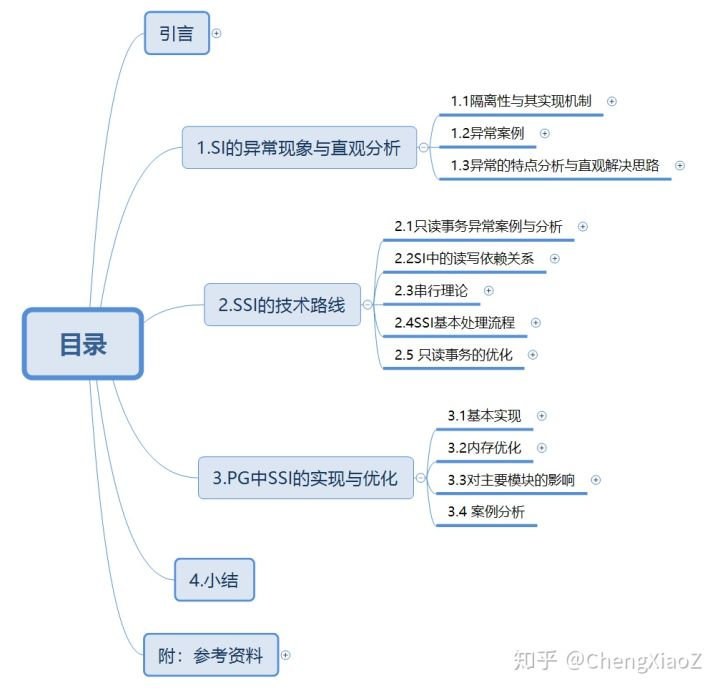

[PostgreSQL9.1](https://link.zhihu.com/?target=https%3A//www.postgresql.org/docs/9.1/static/transaction-iso.html)是第一个采用Serializable Snapshot Isolation（SSI）实现串行化隔离级别的生产级数据库。

本文的目标是学习与分析SSI的设计思路，以及在PG中的实现与优化。首先介绍了隔离级别以及实现其的两个基本并发控制机制，给出了PG的SI未达到串行化的案例，分析原因并给出直观的解决思路，其次阐述了SSI的技术思路与关键环节，最后就PG内核中SSI的实现与优化思路进行了分析。

1.SI的异常现象与直观分析

1.1隔离性与其实现机制

隔离性

隔离性是事务的关键特征之一，用于保证并发访问时的数据一致性。如果一个并发操作序列与一个串行序列的结果相同，则认为此并发操作的结果是一致性（数据库只在此层面保证一致，语义的一致由应用保证）。两个事务对相同数据对象的写写（WW）、写读（WR）、读写（RW）操作存在冲突，读读（RR）操作无冲突。

对于冲突的序列，需要数据库进行并发控制，使其不发生（或者发生后回滚）。锁机制和Snapshot机制是实现该并发控制的基础设施。

S2PL（谓词锁）可实现串行化，但却有较大的性能负担。为了平衡性能与正确性，隔离性被分为分为多个等级，每个等级中锁与Snapshot的处理流程有差异，低等级隔离级别的隔离能力弱但性能负担小。

基于锁的并发控制

锁模式：读操作申请读锁、写操作申请写锁。

冲突处理：相同对象的读写、写读、写写会发生冲突，冲突则等待。

锁的粒度：行、页、表、谓词（index range）。

锁的持续时间：短-操作结束时结束释放，长-事务结束时释放。

2PL：释放锁之后不再加锁。S2PL：事务提交时才释放锁。

基于锁定义的隔离级别

*   lock based read committed：W操作，长写锁，数据对象锁；R操作，短读锁，数据对象锁
*   lock based repeatable read：W操作，长写锁，数据对象锁；R操作，长读锁，数据对象锁
*   lock based serializable：W操作，长写锁，数据对象锁+谓词锁；R操作，长读锁，数据对象锁+谓词锁

基于Snapshot的并发控制

记录的MVCC结构:PG的记录链表与InnoDB的回滚区两种方式。

Snapshot的数据结构：xmin、xmax、list

Snapshot的用途：可以确定在获取Snapshot的时间点，某事务是否已完成。

Snapshot的获取时机：

*   每语句：即每条语句获取一次
*   每事务-每个事务获取一次（第一次访问前）

操作流程:

*   相同对象读写、写读不阻塞，写写阻塞
*   读操作：如果某事务在当前事务获取Snapshot时，已经结束，则某事务的操作结果（插入或删除）对当前事务可见。
*   写操作：First Commit Win。实际采用写锁实现，写操作加锁，获取写锁后流程与基于锁的隔离级别不同。获取写锁后的两种流程：

*   继续加锁型：找到最新的记录版本，继续加锁。
*   版本检查型：如果获取锁的记录被不可见，则回滚，否则继续。

基于Snapshot的隔离级别

*   snapshot based read committed：W操作，长写锁，数据对象锁。获取Snapshot（每语句），持续加锁型。
*   snapshot based repeatable：W操作，长写锁，数据对象锁。获取Snapshot（每事务），版本检查型。

数据库产品中的隔离级别

*   PG/Oracle

*   read committed：snapshot based read committed
*   repeatable read：snapshot based repeatable read

*   InnoDB

*   read committed：snapshot based read committed
*   repeatable read：snapshot based repeatable read（使用继续加锁而不是版本检查，不能避免更新丢失）
*   serializable：lock based serializable

1.2 异常案例

PG的snapshot based repeatable read（下面简称SI）可以避免ANSI标准中提出的三种具体的异常操作序列，但却没有达到串行化级别（SI<< Lock based Serializable）。InnoDB的lock based Serializable实现了串行化级别，可以避免PG的问题。

《A Critique of ANSI SQL Isolation Levels》中给出了异常操作序列的定义，下面列出其中的6个案例，可以看出PG的SI未达到InnoDB的串行化级别。

*   读未提交A1：PG的SI可避免。
*   不可重复读A2：PG的SI可避免
*   幻象A3：PG的SI可避免
*   更新丢失P4：PG的SI可避免
*   幻象A3B：PG的SI无法避免，InnoDB串行化可以避免
*   Write Skew A5B：PG的SI无法避免，InnoDB串行化可以避免

PostgreSQL

设置PostgreSQL隔离级别

SET SESSION CHARACTERISTICS AS TRANSACTION isolation level serializable;

读未提交A1：PG的SI可避免。

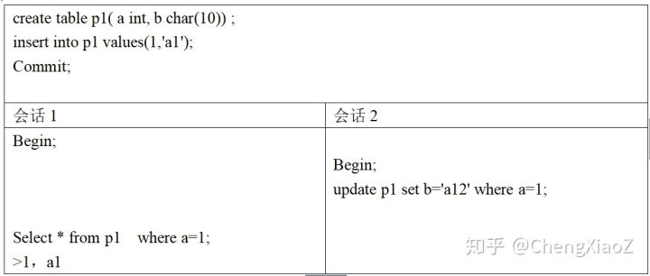

不可重复读A2：PG的SI可避免

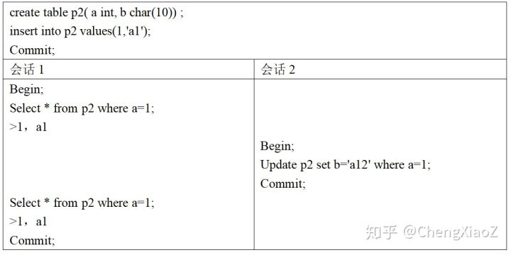

幻象A3：PG的SI可避免

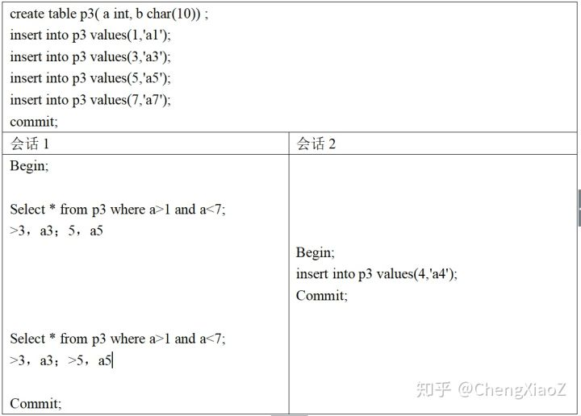

更新丢失P4：PG的SI可避免

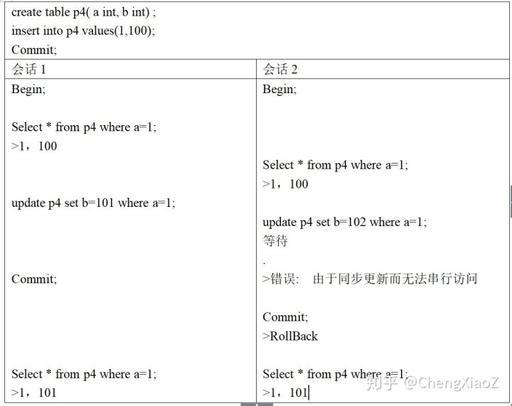

幻象A3B：PG的SI无法避免

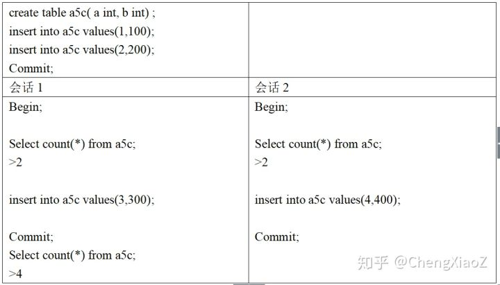

Write Skew A5B：PG的SI无法避免

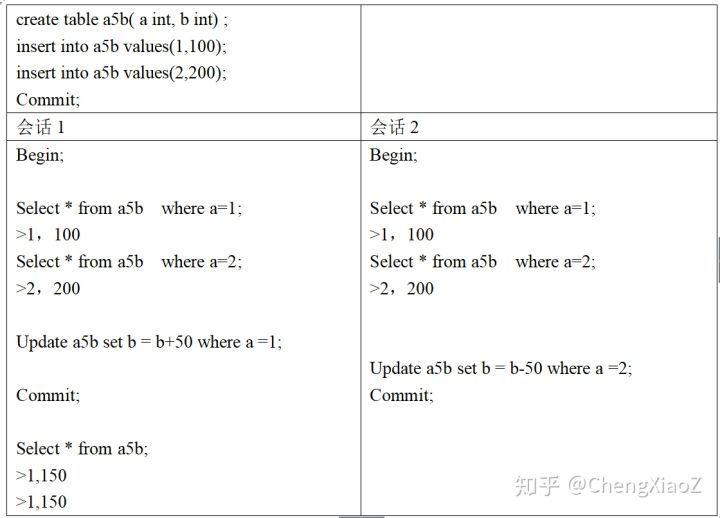

InnoDB

设置隔离级别

set session transaction isolation level serializable;

幻象A3B：InnoDB串行化可以避免

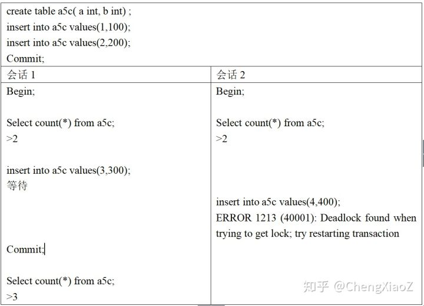

Write Skew A5B：InnoDB串行化可以避免

1.3 异常的特点分析与直观解决思路

SI中，事务内读到的数据都是一致的（复杂情况也会错误，见后），因此可以避免A1、A2和A3，对于A3B和A5B，事务内部读到的数据也是一致的，但是在外部整体上出现了不一致。

P4与A5B非常类似，都是根据先前的数据，进行写操作，只是P4的读与写是相同对象，A3B的读与写是不同对象。P4没有问题，因为写操作有版本检查，这正好可以处理读到数据发生变化的情况，而A3B中读写不同对象，写操作不能发现读的数据发生变化。因此SI的读，需要做登记工作（与lock manager类似，只是不阻塞），用于冲突的判断。

A3B的操作序列中，读操作是一个范围。对这类读操作登记，需要采用类似于谓词锁（range lock）的技术。

根据以上两点，需要在事务提交时，判断读到的数据，是否发生了变化。当发生变化时，一定会导致不一致吗？不一定，对于只有读操作的事务，即使其读到的数据发生了变化，也不一定会影响一致性。因此还需要额外的信息。

S1中读写不冲突，是通过读写同一数据的不同版本实现的。SI中两个调度，R1W2（T1读后T2写），W2R1（W2先写T1读）是等价的，因为W2R1中事务1读到的数据版本与R1W2相同。

基于锁的串行化在处理A3B和A5B时，使用了死锁检测，发现了操作中的特定的依赖关系。基于SI的串行化需要的额外信息正是此类信息，需要在事务提交前，保存依赖并识别出与死锁类似的结构，并进行冲突处理。

下面两部分基于《serializable Snapshot Isolation in PostgreSQL》

2.SSI的技术路线

2.1只读事务异常案例与分析

论文中给出了一个违反直觉的只读事务异常案例。应用为一个事务批处理系统，包括三个事务。receipts表记录了产生的的receipt（可理解为订单，多行记录），control表记录了一个批处理号（只有一行记录）。T2（New Receipt）会定时将新的receipt插入receipts表，具体的信息字段不用关心，只需要关注的批处理号字段。批处理号为一个整数，该信息被储存在control表中。T2插入receipts表前，首先会从control表中获取批处理号，设置为插入记录的批处理号字段。T3（Close Batch）会定期更新control表，原有批处理号增一。T1（Report）是一个只读事务，统计当前批处理号之前的那个批处理信息。

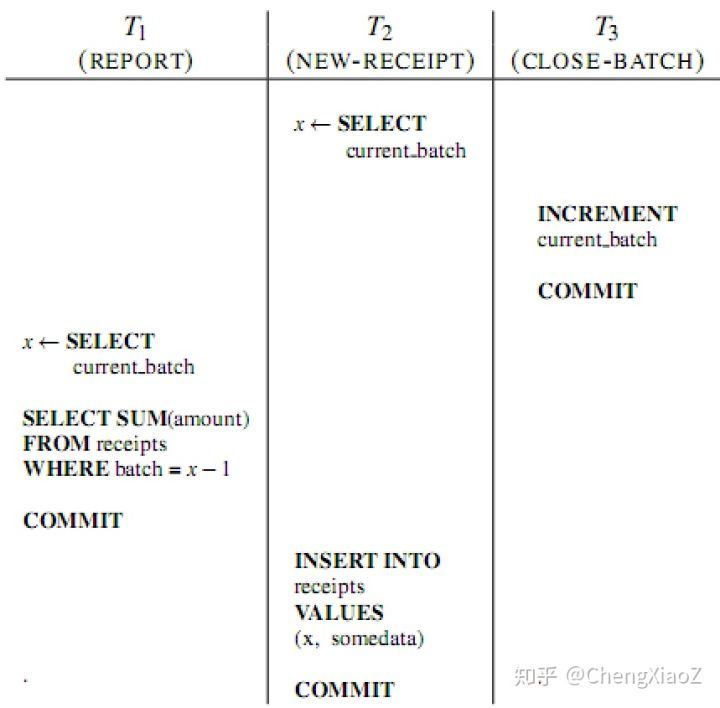

在T1、T2、T3串行执行时，T1每次执行的结果是相同的。而在异常案例中，T1会出现两次读到结果不同的异常。

出现异常的原因是，当前批处理号之前的批处理，必须已经完成，这个串行时存在的假设，在并行时被破坏了。在日常生活也会遇到这样的情况，如统计企业的年度财务报表，不会在新年的第一天，而是要等到所有上一年度的业务全部完成后。

2.2 SI中的读写依赖关系

多版本中事务的依赖关系

Adya给出了一种表示多版本中事务读写依赖关系的方式。图中的节点表示事务。从T1指向T2的边，如T1->T2，表示T1的操作在T2前发生，并可能存在以下的依赖：

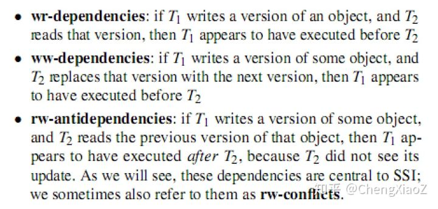

理解

WR依赖与WW依赖，均是T1提交后，T2才启动，T2可以看到T1对数据的修改。

RW反依赖，是T1与T2并发时发生的。T2读操作，T1写操作，无论T2读先执行还是T1写先执行，依赖关系均是读操作指向写操作，因为读操作读到的记录版本比写操作老。

为什么不考虑RW依赖？因为读操作事务提交后，不会对之后启动的写操作事务产生影响。

2.3串行理论

定理1

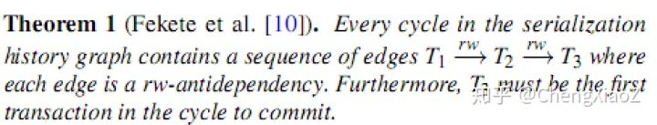

在发生异常有向图环中，必然存在三个事务T1到T2、T2到T3存在读写反向依赖，并且T3最先提交。

推论2

T1与T2并发，T2与T3并发。

采用上述方式描述write skew与只读事务异常。

write skew依赖图

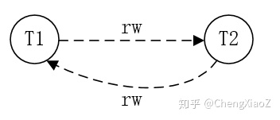

只读事务异常依赖图

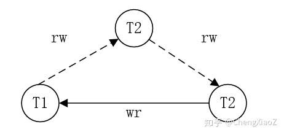

定理的理解

只读事务异常案例中，依赖关系如定义所述，T1与T2有RW反向依赖、T2与T3有反向依赖，且T3先提交。这里可以发现，T1与T2哪一个先提交，均会引起异常。

T1与T3可以为相同事务，write skew就是此种情况。

为什么是T3提交而不是T2先提交呢？从只读事务异常案例中，可以看出T1与T2先提交均不会引起异常。

推论的理解

推论中说T1与T2并发，T2与T3并发。并不是说T1、T2、T3同时并发。例如，T2与T3并发，T3提交之后，T1才启动，此时只有T1与T2并发。

因此T3提交后，其与T2的反向依赖关系必须要保留到T1结束。

2.4 SSI基本处理流程

Cahill介绍了一种SSI检查方法，该方法检查运行中的事务依赖关系图，并选择事务abort，以保证事务的一致性。SSI方法类似于一种基于串行图检测的并发控制协议，该协议中跟踪所有的依赖，并避免cycle的形成。SSI与其不同，SSI只检测"dangerous structure"，即有一条入边和一条出边的结构。当发现此结构时，SSI选择事务回滚。根据定理1，SSI的方法可以保证串行化，但却会有误杀，当仅仅有dangerous structure而没有cycle时。SSI的好处是，不需要记录WR和WW依赖，同时dangerous structure的识别要比cycle检测工作量小很多。

与S2PL和OCC相比，SSI并发性好。在并发事务中，出现一个RW反向依赖时，2PL和OCC都有阻塞，而SSI不会。

SSI需要检测到多版本读写下的冲突的情况，对于读操作需要加SIREAD锁（读写不阻塞，只用于生成RW反向依赖。与S2PL不同，事务commit后SIREAD不能释放，因为与该事务之前并发的事务，可能会写该事务读过（加SIREAD锁）的记录。

SSI的variants

Cahill介绍了一种优化的SSI，可以减少误杀。原有的SSI只判断dangerous structure，根据定理1，优化的SSI上增加了T3先提交的判断。PG的SSI算法采用了该方法。优化的SSI也存在误杀，因为并没有判断依赖中的cycle。

PSSI记录了所有的WR、WW依赖与RW反向依赖，可以判断cycle，从而消除所有的误杀。PG的SSI因为性能的原因，没有采用此方法。

2.5 只读事务的优化

大量的应用场景中，存在只读事务比例高，执行时间长的特点。SSI读操作加SIREAD锁会带来很大负担。为对只读事务进行优化，发展了只读事务异常的串行化理论。基于该理论，做了两点优化

*   采用read-only snapshot ordering优化，减少了误杀。
*   识别safe snapshot。采用safe snapshot的只读事务可以不采用SIREAD锁。进一步发展出deferrable事务，该事务可以延迟执行以确保采用safe snapshot。

只读事务串行理论 定理3

解释：当dangerous structure结构被识别后，如果T1是只读事务，除非T3在T1前提交，否则不会产生异常。对于只读事务，是否产生异常，与其获取snapshot的时间有关，与提交无关。

Safe Snapshot

基于定理3，可得到Safe Snapshot。

T1、T2、T3，当前不存在事务T2到T3的RW反依赖，且T3在T1前已经提交，则T1获取的就是safe snapshot。

safe snapshot不能T1启动时就完全确定。例如，T1启动时，T2到T3有RW反向依赖，但T1到T2是否有反向依赖，此时还不确定。PostgreSQL的实现中，T1启动时，记录活跃的事务，并采用SIREAD锁。当所有活跃事务列表事务都结束，且没有定理3的情况时，T1释放其获取的SIREAD，在其后的操作中不再申请SIREAD锁。

Deferrable事务

对于大数量的查询，根据Safe Snapshot，T1获取活跃事务列表后，可以等待列表中的所有事务结束，再启动查询，完全避免对SIREAD的获取。

3.PG中SSI的实现与优化

在BerkeleyDB和InnoDB中已经有SSI的实现，PG中SSI的实现与其不同。由于没有可以直接利用的锁管理器，PG中新实现了一个锁管理器，由于没有可以直接利用的锁管理器，在PG上实现SSI难度很大。

3.1基本实现

PG的基本并发控制结构

记录与索引。记录采用多版本。没有原地修改，修改操作转换为删除与插入记录，记录的版本直接通过ctid连接（老版本指向新版本）。索引没有版本信息，记录的索引变化会新建索引项。非索引项的修改，采用hot技术。

可见性。记录中包含xmin与xmax字段，分别是插入与删除的事务。事务是否已提交可以通过clog查询。如果根据本事务的snapshot查询，xmin或xmax已经完成且clog的信息为已经提交，则操作效果对本事务可见。

PG中实现了多个类型锁。SpinLock为忙等Mutex，LWLock为读写锁（有等待，无死锁检查，类似latch）， RegularLock为事务级别锁（有等待，有死锁检测），行锁无冲突时，锁信息保存在记录中（通过xmin与xmax状态表示），有冲突时保存在RegularLock中。

冲突检测（检测RW反依赖）

SSI Lock Manager

*   锁模式：只有一个SIREAD类型锁
*   锁的粒度：表、页、行，意图锁采用index page的粒度，未来计划改进为next-key locking。支持锁粒度的升级。
*   未支持意图锁。在各个级别依次检查。
*   锁持续的时间：如前面的分析，SIREAD要维持到与本事务一起活跃的事务结束时。
*   额外的处理

*   与DDL操作的关系（自己未分析过DDL锁，未理解，待分析）
*   数据重组时，锁的对象的ID（记录或index）发生变化，锁的粒度升级为表。

读写处理

*   读到一个记录时的处理：当并行事务对该记录有写锁时（通过snapshot查询，xmin或xmax未完成），产生RW反依赖。
*   写一个记录时的处理：通过SSI lock manager查询，检查记录是否有SIREAD锁，范围查询使用index page的SIREAD锁。当数据对象有SIREAD锁时，产生RW反依赖。

冲突跟踪（事务依赖关系的数据结构）

为每个事务记录所有的RW反依赖。RW反依赖中指向了关联的事务。

记录详细的信息有利于以下处理。

*   实现commit ordering优化。见SSI的variants。
*   只读事务优化。
*   发现dangerous structure时的abort处理
*   内存优化（aggressive清理）

冲突解决

当dangerous structure被识别，且提交顺序（定义1中，T3先提交）满足时，选择某事务回滚，以避免异常发生。

选择回滚的事务满足safe retry原则：该事务被重试时，不应因为原先的情况，再次失败（不准确，大意）。

safe retry原则：

*   T3提交后，才考虑回滚事务。
*   T1与T2中选择T2回滚，因为T2再次执行不会与已经提交的T3有RW关系，而T1再次执行会与T2再次建立RW关系。
*   T2与T3都提交的情况下，回滚T2，再次执行T2不会有RW关系。

3.2内存优化

面对问题

与传统锁管理器相比，SILOCK和RW反依赖不能在事务结束后释放，会占用更多的内存资源。

由于锁表和事务依赖关系可占用的内存大小是固定的（配置文件中指定），需要提供降级能力。在长时间运行事务的情况下，系统不应没有内存资源而拒绝连接，应该通过提高锁的粒度（这样会提高误判率），减少内存占用，从而能接受新的连接。

PG采用进程间共享内存是使用System V的shared memory。默认配置大小为32M（这点自己不理解）。锁表的内存大小无法动态分配。

解决方法

（1）safe snapshot和延迟事务降低了长时间运行的只读事务的影响。

（2）细粒度到粗粒度的锁对象升级。

（3）aggressive cleanup 已提交事务的状态。

*   对于提交事务，其锁表与RW反依赖要保存多长时间？对于SILOCK，需要保存到与其并发的所有事务结束，而事务依赖的信息需要保留更长的时间。（文章中下面举的例子感觉有问题，自己理解如下）。定理1中，例如，T2与T3并发，T3提交之后，T1才启动，此时只有T1与T2并发。因此T3提交后，其提交顺序号必须要保留到T1结束。为防止此问题，在事务节点中记录与其冲突已事务的最早提交顺序号。
*   很明显，当系统中的活跃事务只有只读事务时，已提交事务的SILOCK可以被释放。
*   已提交事务的RW反依赖中in的信息可以被丢弃。（自己理解in是写信息，out是读信息，应该是out信息可以丢弃）

（4）已提交事务状态的summarization

PG的SSI中能够保存的已提交事务数量是固定的。当有更多已提交事务时，需要对已提交事务的信息进行summarize。通常，只需要检测到当前事务与之前已提交的事务发生了冲突，并不需要知道具体的已提交事务。概括在减少内存占用的同时，会提高误判率。

已提交事务状态的概括是基于以下两个发现：

*   活跃事务写一条记录时，需要判断是否某些已提交事务（之前并发的）读过此记录。此冲突只需要知道有已提交事务获取了SILOCK，并不需要知道具体的事务。将已提交事务的SLock关联到一个dummy lock，并在SILOCK中记录最新事务的提交顺序号，用于释放SILOCK。
*   活跃事务读一条记录时，需要判断是否某些已提交事务（之前并发的）写过此记录。两种可能的dangerous structure为：

对于第二种情况，需要知道T3的提交顺序。在概括的情况下，由于此信息被丢弃，增加了一个事务号到与其冲突的最老已提交事务号，来解决此问题。

3.3对主要模块的影响

两阶段提交

显示两阶段提交时，事务会处于prepared状态。对于非SI锁，PG将该prepared事务获取的锁会保存在磁盘上，这样故障恢复时，可以从磁盘中恢复该prepared事务的锁信息。对于SSI锁表及事务依赖关系，占用的容量大，这么做不可行。

由于Prepared成功的事务必须能提交成功，一个优化思路是在Prepared时，做一致性检查。通过检测的事务，需要做summarize。summarization信息是需要保存到磁盘的。

流复制

目前没有在Slave实现SSI。我理解主要是因为查询操作不写日志，为了在Slave构造锁表，需要将SI Lock操作写日志，有工作量。更重要的是，由于safe snapshot机制，slave可以读到一致的数据。扩展safe snapshot机制，Master生成Safesnapshot，并通过xlog复制到Slave节点。Slave节点的读操作使用此Snapshot。

保存点与子事务

自己对于保存点和子事务，未做分析。待处理。

索引类型

目前谓词锁是基于B+树，后面计划扩展到GiST索引。

3.4 SILOCK加锁案例分析

执行write skew案例，查看加锁信息。

创建表、插入数据、查看索引名

create table a5b( a int primary key, b int) ;

insert into a5b values(1,100);

insert into a5b values(2,200);

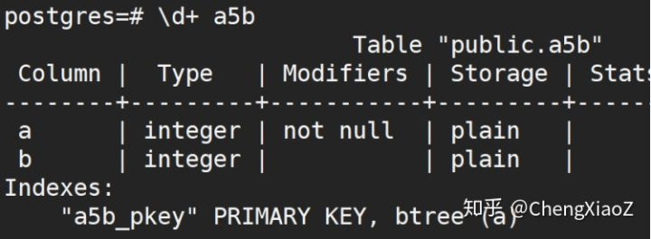

查看数据文件

SELECT lp, lp\_flags, t\_xmin, t\_xmax, t\_ctid,

to\_hex(t\_infomask), explain\_infomask(t\_infomask)

FROM heap\_page\_items(get\_raw\_page(‘a5b‘, 0));

查看索引

SELECT \* FROM bt\_metap(‘a5b\_pkey‘);

SELECT \* FROM bt\_page\_items(‘a5b\_pkey‘, 1);

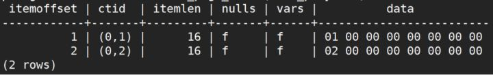

查看表与索引的文件oid

select relname, relfilenode from pg\_class where relname like ‘a5%‘;

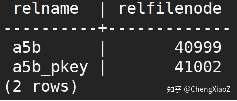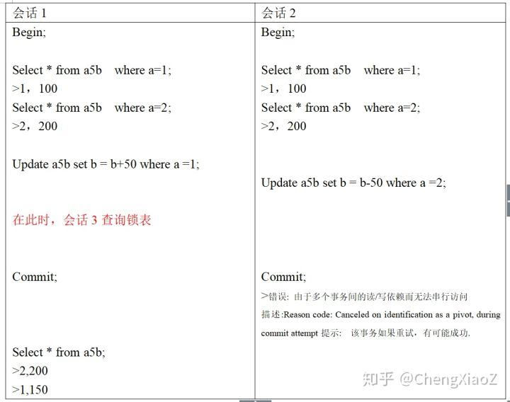

查询锁表

select pid, transactionid, locktype, mode,relation, page, tuple, granted from pg\_locks where pid !=pg\_backend\_pid() and locktype!=‘virtualxid‘ order by pid, locktype;

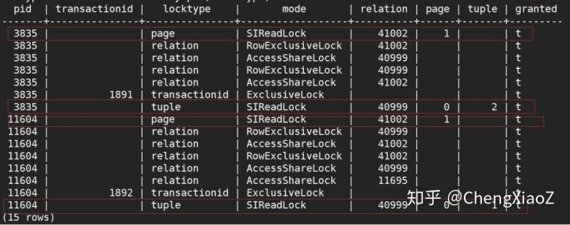

可看出两个会话分别在记录和索引页上获取了SILOCK锁。

4.小结

实际工程中，为减少冲突，提升性能，基于Snapshot的并发控制比基于锁的并发控制使用更加广泛。Oracle、MySQL（InnoDB）和PostgreSQL的默认隔离级别均为基于Snapshot的并发控制。

为实现串行化，传统上只能采用基于锁的并发控制，由于性能问题，很难在实际工程中应用。Serializable Snapshot Isolation（SSI）为高性能的实现可串行化，提供了一种新的路径。

SSI在PostgreSQL中完整的实现与优化，为PostgreSQL的内核扩展工作提供了很好的借鉴思路。

附：参考资料

论文

《A Critique of ANSI SQL Isolation Levels》

《Serializable Snapshot Isolation in PostgreSQL》

书

[《Designing Data-Intensive Applications》第7章](https://link.zhihu.com/?target=https%3A//www.amazon.cn/dp/B075ZBQMM9/)

[《Transaction Processing Concepts and Techniques》 第7、8章](https://link.zhihu.com/?target=https%3A//www.amazon.com/Transaction-Processing-Concepts-Techniques-English/dp/7115195862/)

\-------------------------------------------------------------------------------

[PostgreSQL串行化隔离级别(SSI)的能力与实现](http://www.mamicode.com/info-detail-2875726.html "PostgreSQL串行化隔离级别(SSI)的能力与实现,mamicode.com")

标签：[control](http://www.mamicode.com/so/1/control "control")   [sha](http://www.mamicode.com/so/1/sha "sha")   [同事](http://www.mamicode.com/so/1/%e5%90%8c%e4%ba%8b "同事")   [tran](http://www.mamicode.com/so/1/tran "tran")   [复制](http://www.mamicode.com/so/1/%e5%a4%8d%e5%88%b6 "复制")   [拒绝](http://www.mamicode.com/so/1/%e6%8b%92%e7%bb%9d "拒绝")   [defer](http://www.mamicode.com/so/1/defer "defer")   [内存优化](http://www.mamicode.com/so/1/%e5%86%85%e5%ad%98%e4%bc%98%e5%8c%96 "内存优化")   [数据文件](http://www.mamicode.com/so/1/%e6%95%b0%e6%8d%ae%e6%96%87%e4%bb%b6 "数据文件")   

原文地址：https://www.cnblogs.com/dhcn/p/12090799.html

踩

(0)

赞

(0)

举报

评论 一句话评论（0）

登录后才能评论！

---------------------------------------------------

原网址: [访问](http://www.mamicode.com/info-detail-2875726.html)

创建于: 2020-09-12 20:45:42

目录: default

标签: `www.mamicode.com`

