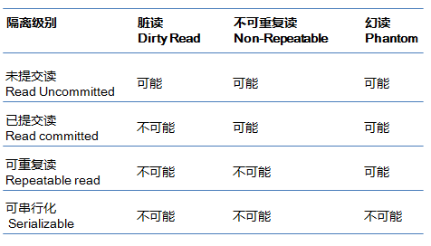
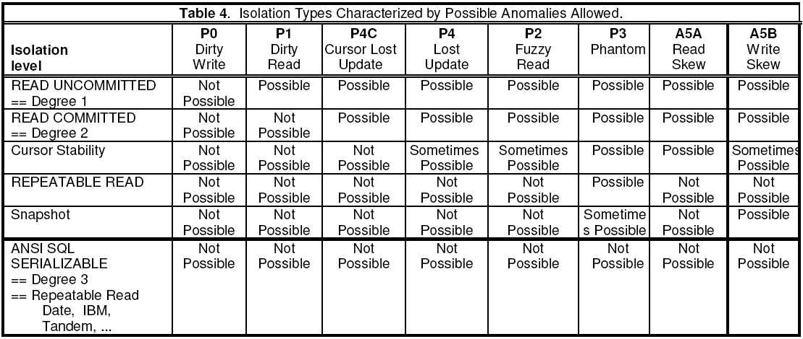
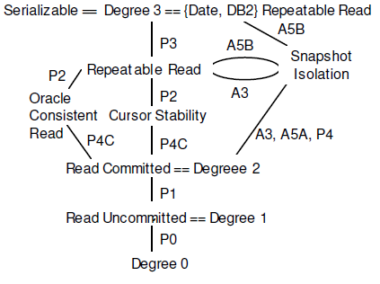
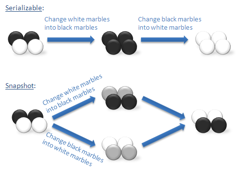

# 再谈数据库事务隔离性 - 海边的Ivan - 博客园

### 写在前面

近两年分布式数据库技术加速发展，而由于金融行业技术生态的限制，周围很多同学对其并没有深入的了解，所以进行高性能、高可靠系统设计时往往缺少这一利器。Ivan希望以系列文章的方式与大家交流探讨，加深我们对分布式数据库的认识。本文是该系列文章的第一篇，主要探讨事务管理中的隔离性，厘清相关概念和关键技术，为后面阐述分布式数据库的事务管理做一个铺垫，姑且算是一篇前传吧。

* * *

### 正文

我们首先从定义出发，事务管理包括原子性、一致性、隔离性和持久性四个方面，即ACID。所有数据库专著都会给出这个四个特性的定义，本文我们引用了Jim Gray对其的定义。

> _Jim Gray是事务处理方面的大师，本文中很多内容都来自他的专著和论文。为避免翻译引入的歧义，这里我们直接引用原文。_

> _**Atomicity**_: _Either all the changes from the transaction occur (writes, and messages sent), or none occur._  
> _**Consistency**_: _The transaction preserves the integrity of stored information._  
> _**Isolation**_: _Concurrently executing transactions see the stored information as if they were running serially (one after another)._  
> _**Durability**_: _Once a transaction commits, the changes it made (writes and messages sent) survive any system failures._

在上述隔离性（Isolation）的定义中，我们可以发现其目标是使并发事务的执行效果与串行一致，但在具体技术实现上往往需要在并发能力和串行化效果之间进行平衡，很难两者兼顾。平衡的结果就是会出现违反串行效果的现象即异常现象（Phenomenon）。通常来说，隔离级别的提升伴随着并发能力的下降，两者负相关。各种数据库在谈到隔离级别时都会引用ANSI SQL-92标准隔离级别，我们来看看它的具体内容。

#### ANSI SQL-92 Isolation Levels

ANSI SQL-92可能是最早提出了基于异常现象来定义隔离级别的方法，同时没有将隔离级别与具体实现机制绑定，隔离的实现可以基于锁（lock-based）或者无锁（lock-free），兼容了后续的技术发展。该标准根据三种异常现象将隔离性定义为四个级别，具体如下。



> **脏读**，事务（T1）中修改的数据项在尚未提交的情况下被其他事务（T2）读取到，而T1进行Rollback操作，则T2刚刚读取到的数据并没有实际存在。  
> **不可重复读**，T1读取数据项，T2对其中的数据进行了修改或删除且Commit成功。如果T1尝试再次读取这些数据，会得到T2修改后的数据或者发现数据已删除。这样T1在一个事务中两次同样条件的读取，且结果集内容变更或结果集数量减少。  
> **幻读**，T1使用特定的查询条件获得一个结果集，T2插入新的数据且这些数据符合T2刚刚操作的查询条件。T2 commit 成功后，T1再次执行同样的查询，此时得到的结果集增大。

很多文章都结合数据库产品对上述异常现象的实例和处理机制进行了说明，本文中不再赘述，有兴趣的同学可以参考文末的链接\[1\]。

ANSI SQL-92标准早在92年发布，但无论是当时还是后来都没有被各大数据库厂商严格遵循，部分原因可能是标准过于简化与实际应用有一定程度的脱离。Jim Gray等人在1995发布了论文“A Critique of ANSI SQL Isolation Levels” （本文中简称为Critique\[2\]）对隔离级别进行更全面的阐述，可以帮助我们加深理解。

#### Critique Isolation Levels

Critique提出了ANSI SQL-92存在的两个问题，首先是自然语言方式界定的异常现象并不严格导致一些同质化的异常现象被遗漏；其次是一些典型的异常现象并没有被涵盖进去，导致隔离级别存在明显缺失。因此，文中对ANSI SQL-92的三种异常现象（将其编号为A1/A2/A3）进行了扩展（编号为P1/P2/P3），并增加了另外5种常见的异常现象。受限于篇幅，这里仅对两种异常现象进行说明。

##### Lost Update

丢失更新（Lost Update）是一个经典的数据库问题，由于太过重要所有主流数据库都解决了该问题，我们这里将操作稍加变形来举例。

我们使用MySQL进行演示，创建表并初始化数据

```SQL
create table account (balance int,name varchar(20)) ENGINE=InnoDB;
insert into account values(50,'Tom');
```

| T1 | T2 |
| --- | --- |
| `begin;` | `begin;` |
| `select balance into @bal from account where name='Tom'`  
\--------------------  
`@bal = 50` |  |
|  | `select balance into @bal from account where name='Tom'`  
\-------------------  
`@bal = 50` |
|  | `update account set balance = @bal -40 where name = ‘Tom’;` |
|  | `commit;` |
| `update account set balance = @bal - 1 where name = ‘Tom’;` |  |
| `commit;` |  |

在上述操作中T1、T2串行执行效果是对余额进行两次扣减，分别为40和1，最终值为9，但并行的最终值为49，T2的修改被丢失。我们可以发现Lost update的实质是T1事务读取数据，而后该数据被T2事务修改并提交，T1基于已经过期的数据进行了再次修改，造成T2的修改被覆盖。

##### Read Skew

读偏序（Read Skew）是RC级遇到的问题。如果数据项x与y存在一致性约束，T1先对读x，而后T2修改x和y后commit，此时T1再读y。T1得到的x与y不满足原有的一致性约束。

MySQL默认隔离级别为RR，我们需要手工设置为RC并初始化数据

```SQL
set session transaction isolation level read committed;
insert into account values(70,'Tom');
insert into account values(30,'Kevin');
```

| T1 | T2 |
| --- | --- |
| `begin`; | `begin`; |
| `select * from account where name=’Tom’;`  
\---------------------  
`balance name`  
`70 Tom` |  |
|  | `select * from account where name=’Tom’;`  
\---------------------  
`balance name`  
`70 Tom` |
|  | `update account set balance = balance - 30 where name='Tom';` |
|  | `update account set balance = balance + 30 where name=’Kevin’;` |
|  | `commit;` |
| `select * from account where name='Kevin';`  
\---------------------  
`balance name`  
`60 Kevin` |  |
| `commit;` |  |

初始数据Tom与Kevin的账户合计为100，在T1事务内的两次读取得到账户合计为130，显然不符合之前的一致性约束。

补充这些异常现象后，Critique给出了新的矩阵，相比ANSI更加完善也更贴合真实的数据库产品。



主流数据库考虑到串行化效果与并发性能的平衡，一般默认隔离级别都介于RC与RR之间，部分提供了Serializable。特别提醒，无论ASNI SQL-92还是Critique的隔离级别都不能确保直接映射到实际数据库的同名隔离级别。

#### SI&MVCC

**快照隔离**（SI,Snapshot Isolation）是讨论隔离性时常见的术语，可以做两种的解读，一是具体的隔离级别，SQL Server、CockroachDB都直接定义了这个隔离级别；二是一种隔离机制用于实现相应的隔离级别，在Oracle、MySQL InnoDB、PostgreSQL等主流数据库中普遍使用。**多版本并发控制**（MVCC，multiversion concurrency control）是通过记录数据项历史版本的方式提升系统应对多事务访问的并发处理能力，例如避免单值（Single-Valued）存储情况下写操作对读操作的锁排斥。MVCC和锁都是SI的重要实现手段，当然也存在无锁的SI实现。以下是Critique描述的SI运作过程。

> 事务（记为T1）开始的瞬间会获取一个时间戳Start Timestamp（记为ST），而数据库内的所有数据项的每个历史版本都记录着对应的时间戳Commit Timestamp（记为CT）。T1读取的快照由所有数据项版本中那些CT小于ST且最近的历史版本构成，由于这些数据项内容只是历史版本不会再次被写操作锁定，所以不会发生读写冲突，快照内的读操作永远不会被阻塞。其他事务在ST之后的修改，T1不可见。当T1 commit的瞬间会获得一个CT，并保证大于此刻数据库中已存在的任意时间戳（ST或CT），持久化时会将这个CT将作为数据项的版本时间戳。T1的写操作也体现在T1的快照中，可以被T1内的读操作再次读取。当T1 commit后，修改会对那些持有ST大于T1 CT的事务可见。  
> 如果存在其他事务（T2），其CT在T1的运行间隔【ST，CT】之间，与T1对同样的数据项进行写操作，则T1 abort，T2 commit成功，这个特性被称为First-committer-wins，可以保证不出现Lost update。事实上，部分数据库会将其调整为First-write-wins，将冲突判断提前到write操作时，减少冲突的代价。

这个过程不是某个数据库的具体实现，事实上不同数据库对于SI实现存在很大差别。例如，PostgreSQL会将历史版本和当前版本一起保存通过时间戳区分，而MySQL和Oracle都在回滚段中保存历史版本。MySQL的RC与RR级别均使用了SI，如果当前事务（T1）读操作的数据被其他事务的写操作加锁，T1转向回滚段读取快照数据，避免读操作被阻塞。但是RC的快照定义与以上描述不同，也包括了T1执行过程中其他事务提交的最新版本\[6\]。

此外，我们还有一个重要发现，时间戳是生成SI的关键要素。在单机系统中，唯一时间戳比较容易实现，而对于分布式系统在跨节点、跨数据中心甚至跨城市部署的情况下如何建立一个唯一时钟就成为一个非常复杂的问题，我们暂留下一个伏笔将在后面的专题文章中进行讨论。

##### Serializable VS SSI

SI是如此有效，甚至在TPC-C benchmark测试中也没有出现任何异常现象\[5\]，但事实上SI不能保证完整的串行化效果。Critique中指出，SI还无法处理A5B（Write Skew，写偏序），如下图所示。



##### Write Skew

写偏序（Write Skew）也是一致性约束下的异常现象，即两个并行事务都基于自己读到的数据集去覆盖另一部分数据集，在串行化情况下两个事务无论何种先后顺序，最终将达到一致状态，但SI隔离级别下无法实现。下图的“黑白球”常常被用来说明写偏序问题。



如何实现真正的串行化效果呢？事实上，早期的数据库已经通过严格两阶段锁协议（S2PL，Strict Two-Phase Locking）实现了完全的串行化隔离（Serializable Isolation），即正在进行读操作的数据阻塞对应写操作，写操作阻塞所有操作（包括读操作和写操作）。如阻塞造成循环将构成死锁，则需要进行rollback操作。S2PL的问题显而易见，在竞争激烈场景下，阻塞和死锁会造成数据库吞吐量下降和响应时间的增加，所以这种串行化无法应用于实际生产环境。直到SSI的出现，人们终于找到具有实际价值的串行化隔离方案。

**串行化快照隔离**（SSI, Serializable Snapshot Isolation，也会被翻译为序列化快照）是基于SI改进达到Serializable级别的隔离性。SSI由Michael James Cahill在他的论文"Serializable Isolation for Snapshot Databases"\[3\]中提出（该论文获得2008 Sigmod Best Paper Award，文章末尾提供了该论文的2009年完整版\[4\]相关信息，有兴趣的同学可以深入研究）。SSI保留了SI的很多优点，特别是读不阻塞任何操作，写不会阻塞读。事务依然在快照中运行，但增加了对事务间读写冲突的监控用于识别事务图（transaction graph）中的危险结构。当一组并发事务可能产生异常现象（anomaly），系统将通过回滚其中某些事务进行干预以消除anomaly发生的可能。这个过程虽然会导致某些事务的错误回滚（不会导致anomaly的事务被误杀），但可以确保消除anomaly\[3\]。

从理论模型看，SSI性能接近SI，远远好于S2PL。2012年，PostgreSQL在9.1版本中实现了SSI\[7\]，可能也是首个支持SSI的商业数据库，验证了SSI的实现效果。CockroachDB也从Cahill的论文获得灵感，实现SSI并将其作为其默认隔离级别。

随着技术的发展，SI/SSI已经成为主流数据库的隔离技术，尤其是后者的出现，无需开发人员在代码通过显式锁来避免异常，从而降低了人为错误的概率。在分布式数据库的相关章节中，我们将进一步对SSI实现机制进行深入探讨。

* * *

参考文献  
\[1\]Innodb中的事务隔离级别和锁的关系，ameng，[https://tech.meituan.com/innodb-lock.html](https://tech.meituan.com/innodb-lock.html)  
\[2\]H. Berenson, P. Bernstein, J. Gray, J.Melton, E. O’Neil,and P. O’Neil. A critique of ANSI SQL isolation levels. InProceedings of the SIGMOD International Conference on Management of Data, pages1–10, May 1995.  
\[3\]Michael J. Cahill, Uwe Röhm, and Alan D.Fekete. 2008. Serializable isolation for snapshot databases. In SIGMOD ’08:Proceedings of the 2008 ACM SIGMOD international conference on Management of data, pages 729–738, New York, NY, USA. ACM.  
\[4\]Michael James Cahill. 2009. Serializable Isolation for Snapshot Databases. Sydney Digital Theses. University of Sydney, School of Information Technologies  
\[5\] A. Fekete, D. Liarokapis, E. O’Neil, P.O’Neil, andD. Shasha. Making snapshot isolation serializable. In ACM transactions on database systems, volume 39(2), pages 492–528, June 2005.  
\[6\]姜承尧,MySQL技术内幕：InnoDB存储引擎机, 械工业出版社, 2011  
\[7\][https://wiki.postgresql.org/wiki/Serializable](https://wiki.postgresql.org/wiki/Serializable)

---------------------------------------------------


原网址: [访问](https://www.cnblogs.com/ivan-uno/p/8274355.html)

创建于: 2020-09-12 21:23:49

目录: default

标签: `www.cnblogs.com`

