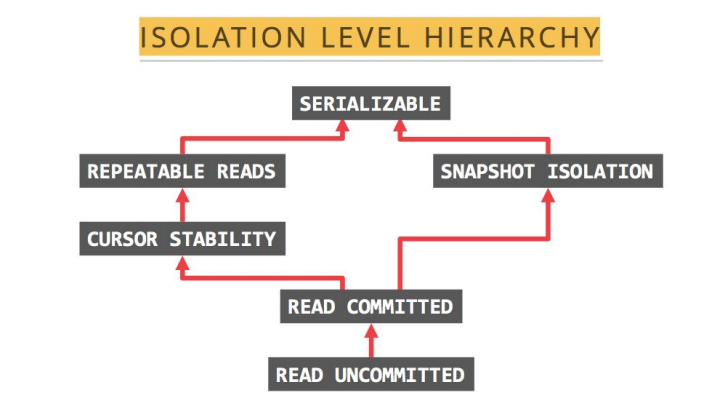
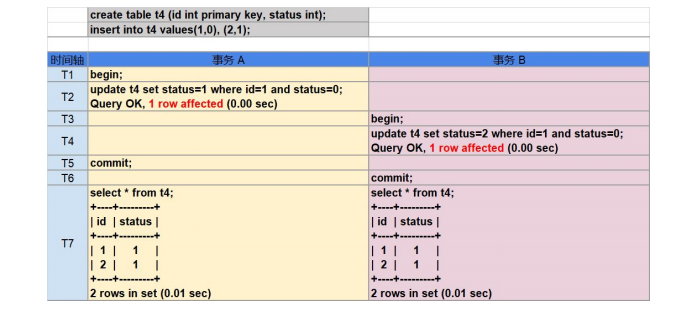
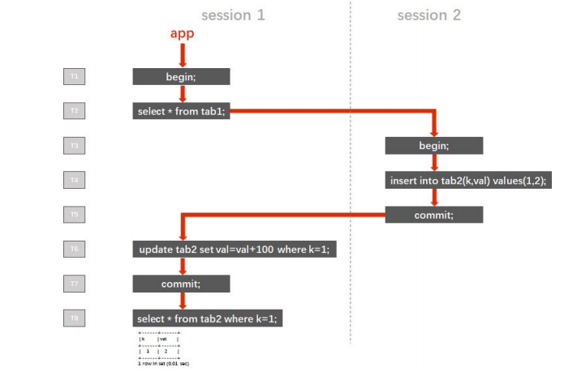

# (三)分布式数据库tidb-隔离级别详解 - 咸鱼也要有梦想 - 博客园

**tidb隔离级别详解:**

****

1.TiDB 支持的隔离级别是 **Snapshot Isolation（SI）**，它和 Repeatable Read（RR） 隔离级别基本等价，详细情况如下：

　　● TiDB 的 SI 隔离级别可以克服幻读异常（Phantom Reads），但 ANSI/ISO SQL 标准中的 RR 不能。

　　所谓幻读是指：事务 A 首先根据条件查询得到 n 条记录，然后事务 B 改变了这 n 条记录之的 m 条记录或者增添了 m 条符合事务 A 查询条件的记录，导致事务 A 再次发起请求时发现有 n+m 条符合条件记录，就产生了幻读。

　　● TiDB 的 SI 隔离级别不能克服写偏斜异常（Write Skew），需要使用 Select for update语法来克服写偏斜异常。写偏斜异常是指两个并发的事务读取了两行不同但相关的记录，接着这两个事务各自更新了自己读到的那行数据，并最终都提交了事务，如果这两行相关的记录之间存在着某种约束，那么最终结果可能是违反约束的。

　　例如，值班表有两列，姓名以及值班状态，0 代表不值班，1 代表值班 

<table border="0"><tbody><tr><td>姓名</td><td>值班状态</td></tr><tr><td>张三</td><td>0</td></tr><tr><td>李四</td><td>0</td></tr><tr><td>王五</td><td>0</td></tr></tbody></table>

　　有这样一个事务，它的逻辑是判断当前无人值班，则分配一个值班人。当该程序顺序执行时，只会分配一个值班人。但当它并行执行时，就可能出现多人同时为值班状态的错误。

　　● TiDB 在默认配置下（tidb\_disable\_txn\_auto\_retry=0）不能克服丢失更新异常（LostUpdates）。

　　所谓丢失更新是指：两个事务 A，B 读取相同记录并更新同一列的值，若 A 先于 B 提交事务，当 B 事务提交后 A 再次查询时发现自己的更新丢失了。

　　 2. 显式事务中 DML 语句返回的 affected rows 不可信与所有使用了乐观锁机制的分布式数据库（PXC, MGC, MGR 等）一样，在显式执行的事务中（设置为非自动提交 autocommit=0，或使用 begin 语句显式声明事务开始），DML操作所返回的 affected rows 并不保证与最终提交事务时所影响的数据行数一致。

　　　　如下案例，事务 B 在并发中丢失了它的更新: 

　　这是由于在显式执行的事务中 DML 操作与提交操作分开被执行，在事务提交过程中，如果由于事务冲突，找不到 TiKV，网络不稳定等原因而发生了重试，TiDB 将获取新的时间戳

重新执行本事务中的 DML 操作，原本的 SI 隔离级别在重试后会产生类似 RC 隔离级别的不可重复读与幻读异常现象。 由于重试机制在内部完成，如果最终本事务提交成功，用户一般是无法感知到是否发 生了重试的，因此不能通过 affected rows 来作为程序执行逻辑的判断条件。 而隐式事务中（以单条 SQL 为单位进行提交），语句的返回是提交之后的结果，因此 隐式事务中的 affected rows 是可信的。

　　3. 避开丢失更新影响的应用开发方法 TiDB 使用了乐观锁机制，乐观锁仅在提交时才会进行冲突检测和数据上锁。在使用了 非 select for update 的 SQL 语句时，TiDB 会对提交时遇到冲突而发生退避的事务进行自动重 试（由 tidb\_disable\_txn\_auto\_retry 变量控制，默认行为是自动重试），当事务达到退避次数限 制（默认 10 次）依然不能成功提交时，事务会被回滚。 发生了退避的事务会重新获取时间戳，重新执行事务中的增删改语句，这样设计是为 了规避上一次造成提交失败的原因（包括但不限于锁冲突），但也因此导致了并发事务可能出 现丢失更新异常。 可以通过妥善的应用实现方式来避免丢失更新造成的影响。

　　场景一，在不做余额检查的类似转账交易场景中，一般通过账号筛选出需要修改余额 的记录，然后直接在数据库中进行数学运算的 SQL 来实现对账户余额的更新，诸如此类写法 的事务即使在并发执行时遇到了丢失更新异常，也可以正确的完成转账操作，并不会被用户感 知到：

update account set realtimeremain = realtimeremain-100 where cuno='A';

update account set realtimeremain = realtimeremain+100 where cuno='B';

commit;

　　同上转账场景，如果实现方式是应用获取了当前转入转出账户的余额后，在应用中计 算出转账后两账户的余额，使用常值写入余额字段，这样的实现方式在事务并发执行时将会导 致错误：

　　select realtimeremain from account where cuno='A';

　　--返回 1000

　　select realtimeremain from account where cuno='B';

　　--返回 1000

　　--应用中计算出两账户转账后的余额分别为 900 和 1100

　　update account set realtimeremain = 900 where cuno='A'; update account set realtimeremain = 1100 where cuno='B';

　　commit;

　　4. 计数器，秒杀场景的处理方法 如上一段所讲，TiDB 采用了乐观锁机制，在事务的并发处理中，TiDB 会自动重试提 交时遇到冲突而发生退避的事务；而在使用了 select for update 或关闭 tidb\_disable\_txn\_auto\_retry 变量时，这种退避机制会失效，后提交的事务会被回滚。 select for update 被使用于计数器，秒杀，公用账户、理财产品、国债的余额扣减等场 景，技术特点是并发的对同一行数据进行修改。传统的单机 DBMS 多使用悲观锁来实现 select for update，在事务开始的时候即进行锁检查，如果事务所需要的锁和数据上当前的锁不 兼容，就会发生锁等待，等当前的锁释放后本事务才能执行。TiDB 在执行 select for update 时 相当于悲观锁系统中将锁等待时间设置为 0，遇到锁冲突的事务会执行失败。 综上，TiDB 不适合用于处理高并发的对同一行数据进行修改，事务使用了 select for update 语句，可以保证数据的一致性，但并发执行的事务中，只有最先提交的事务会成功，其 余的并发请求都会被回滚。 处理计数器场景的最佳实践是将计数器功能转移到缓存（redis，codis 等）中实现，如 购买国债产品场景中，将国债余额读取到缓存中，在缓存中根据余额与购买额度对请求队列进 行控制，向合格的请求发放访问数据库的令牌，向购买额度超过余额的请求返回余额不足的错 误，拿到令牌的请求可以并发去修改数据库中的产品余额。 在应用了悲观锁的 DBMS 中，并发的 select for update 事务实际上是被排成队列以串行 的方式执行的，因此性能不高，而使用缓存来处理计数器场景也有着较大的性能优势。

　　5. “嵌套事务” 遵照 ACID 理论，并发事务间应彼此相互隔离，避免互相干扰。即事务不能“嵌套”。 在 Read Committed 隔离级别下，同一事务中如果存在多次读取，每次读到的都是当 时已经提交的数据，在多个事务并发执行时，一个事务内多次读取的结果可能千差万别，这种 现象被称为“不可重复读（Non-repeatable Reads）”。应用于传统金融行业的 RDBMS 产品中，默认隔离级别为 RC 的产品占有绝大部分市 场份额，而应用开发中也很少有人注意到隔离级别的设置，因此“不可重复读”往往被应用开发 人员认为是一种功能，甚至据此开发了基于“嵌套事务”的应用。 下图中的案例描述了一个典型的“嵌套事务”的执行逻辑（红色箭头）。session 1 和 session 2 是该程序开启的两个会话，左侧的 T1 ~ T8 是时间轴。程序在 T1 的时候开启了一 个会话 session 1，然后执行了一个查询（注意，在 MySQL 协议中，begin 的下一条有数据 访问的语句被视为事务的开始）。之后的 T3 ~ T5，程序开启了另一个会话 session 2，写入 了一行数据后提交。然后程序继续操作 session 1，在 T6 时它试图更新这行刚刚写入的数据 ，并在 T7 时提交了 T2 时开启的本事务。 T8 时，session 1 执行了一条查询语句，来检查最初在 T4 时由 session 2 写入的 k=1 对应行的 val 值。

在 RC 隔离级别下，T8 时查询的返回值为 102，看上去似乎满足了“嵌套事务”的功能 需求。但实际上这是错误的，案例中仅使用单线程模拟了“嵌套事务”的场景，在实际业务的并 发请求下，多个事务在时间轴上交错执行，交错提交，将使“嵌套事务”的执行结果变得不可预 知。 在 SI 或 RR 隔离级别下，直到提交或回滚之前的任何读取（不限于 tab1 表）所返回 的结果都对应事务开始的那个瞬间的一致性状态。也就是说，在 T2 时，session 1 中的事务所能读取到的数据就已经确定了，它就像是给数据库在 T2 时的留下了一个快照，即使之后的 T3 ~ T5 开启了新的 session 2，写入数据并提交，也不会影响 T6 时 session 1 所读取到的数 据，T6 未读取到 k=1 的行，因此更新了 0 行。在 T8 时，查询的返回值为 2。在 SI 或 RR 隔 离级别下，事务间的隔离度更高了，在并发请求下，其结果也是可预期的。 在这个案例中，如果只是想实现 session 1 能够更新到 session 2 写入的数据的需求， 只需要控制程序逻辑，在 T2 时的查询语句之后添加 commit 步骤，及时提交这个查询事务， 再执行后续步骤即可。

　　6. 不支持 Spring 框架的 PROPAGATION\_NESTED 传播行为 （依赖 savepoint 机制） Spring 支持的 PROPAGATION\_NESTED 传播行为会启动一个嵌套的事务，它是当前事 务之上独立启动的一个子事务。嵌套事务开始时会记录一个 savepoint， 如果嵌套事务执行失 败，事务将会回滚到 savepoint 的状态，嵌套事务是外层事务的一部分，它将会在外层事务提 交时一起被提交。下面案例展示了 savepoint 机制：

mysql> BEGIN; mysql> INSERT INTO T2 VALUES(100);

mysql> SAVEPOINT svp1;

mysql> INSERT INTO T2 VALUES(200);

mysql> ROLLBACK TO SAVEPOINT svp1;

mysql> RELEASE SAVEPOINT svp1;

mysql> COMMIT;

mysql> SELECT \* FROM T2; +------+ | ID | +------+ | 100 | +------+ TiDB

不支持 savepoint 机制，因此也不支持 PROPAGATION\_NESTED 传播行为，基于 Java Spring 框架的应用如果使用了 PROPAGATION\_NESTED 传播行为，需要在应用端做出调 整，将嵌套事务的逻辑移除。

　　7. 大事务 基于日志的数据库在面对大事务时，需要手动调大可用日志的容量，以避免日志被单 一事务占满。 TiDB 中对于事务量有着硬限制，由于 TiDB 分布式两阶段提交的要求，修改数据的大 事务可能会出现一些问题。因此，TiDB 对事务大小设置了一些限制以减少这种影响（一行数据是一个键值对，一行索引也是一个键值对，当一张表只有 2 个索引时，每 insert 一行数据 会写入 3 个键值对）：

● 每个键值对不超过 6MB

● 键值对的总数不超过 300,000

● 键值对的总大小不超过 100MB 据此，涉及大量数据增删改的事务（如批量的对账事务等），需要进行缩减事务量的 改造，最佳实践是将大事务改写为分页 SQL，分段提交，TiDB 中可以利用 order by 配合 limit 的 offset 实现分页功能，写法如下：

update tab set value=’new\_value’ where id in (select id from tab order by id limit 0,10000); commit;

update tab set value=’new\_value’ where id in (select id from tab order by id limit 10000,10000); commit;

update tab set value=’new\_value’ where id in (select id from tab order by id limit 20000,10000); commit;

